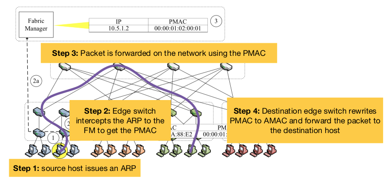

+++
title = 'Data center networking'
+++

## Data center networking
In data centers, servers are organized in interconnected racks.

Performance metrics:
- bisection width: minimum number of links cut to divide network in half
- bisection bandwidth: minimum bandwidth of links that divide network in half
- full bisection bandwidth: one half of nodes can communicate at the same time with other half of nodes

Oversubscription: ratio (worst-case required aggregate bandwidth among end-hosts)/(total bisection bandwidth of topology)

### Fat-tree topology
Example of 4-port fat-tree topology:

Allows full bisection bandwidth between core and aggregation switches.

For k-port switches:
- need (5k²/4) switches
- can have k³/4 servers

Addressing:
- pod switches: 10.pod.switch.1 (pod, switch ∈ [0, k-1])
- core switches: 10.k.j.i (i and j denote core positions)
- hosts: 10.pod.switch.id

Forwarding: two-level lookup table
- prefixes for forwarding traffic in pod
- suffixes for forwarding traffic between pods

Each host-to-host communication has single static path.

Flow-collision happens when multiple flows use same path.
Solutions:
- equal-cost multi-path (ECMP): static path for each flow
- flow scheduling: centralized scheduler assigns flows to paths

Challenges & issues
- must be backward compatible with IP/Ethernet
- complex wiring
- no support for seamless VM migration (would break TCP connection)
- plug-and-play not possible, IPs have to be preassigned

### PortLand
Separate node location (Pseudo MAC) from node identifier (Host IP).

Fabric manager maintains IP → PMAC mapping .

Switches self-discover location by exchanging Location Discovery Messages.

