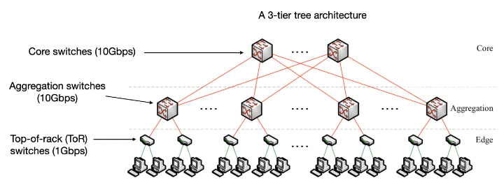
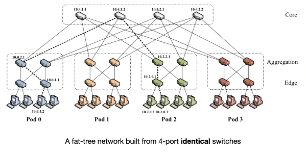
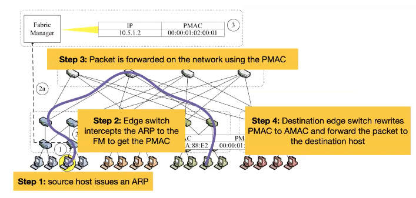

+++
title = 'Datacenter networking'
+++

# Datacenter networking
Why not a single giant switch? Limited port density, broadcast storms, isolation.

Tree-based data center network:

Bottleneck is in the top 2 layers.

Performance metrics:
- bisection width: minimum number of links cut to divide network into two halves
- bisection bandwidth: minimum bandwidth of links that divide network into two halves
- full bisection bandwidth: one half of nodes can communicate at the same time with other half of nodes

Oversubscription: ratio -- (worst-case required aggregate bandwidth among end-hosts) : (total bisection bandwidth of network topology)
- 1:1 -- all hosts can use full uplink capacity
- 5:1 -- only 20% of host bandwidth may be available

## Fat-tree
Fat-tree topology: emulate single huge switch with many smaller switches

Needs to be backward compatible with IP/Ethernet, so routing algorithms naively choose shortest path, leading to bottleneck. And you get complex wiring.

Addressing:
- 10.0.0.0/8 private address block
- pod switches: 10.pod.switch.1
- core switches: 10.k.j.i, with i and j core positions in (k/2)² core switches
- hosts: 10.pod.switch.id

Forwarding with two-level lookup table:
- prefix used for forwarding intra-pod traffic
- suffixes for forwarding inter-pod traffic

Routing:
- prefixes in two-level lookup table prevent intra-pod traffic from leaving pod
- each host-to-host communication has single static path

Flow collision can lead to bottleneck:
- use equal-cost multi-path (ECMP): static path for each flow
- or flow scheduling: have centralised scheduler to assign flows to paths

To solve cabling issue, organize switches into pod racks.

Unaddressed issues:
- no support for seamless VM migration, because IPs location-dependent
- plug-and-play not possible: IPs pre-assigned to switches and hosts

## PortLand: layer 2 system
Intuition: separate node location from node identifier.
- IP is node identifier
- Pseudo MAC is node location

Fabric manager maintains IP → PMAC mapping, and facilitates fault tolerance.

Switches self-discover location by exchanging Location Discover Messages (LDMs):
- tree level/role: based on neighbor identify
- pod number: get from Fabric manager
- position number: aggregation switches help top-of-rack switches choose unique number

