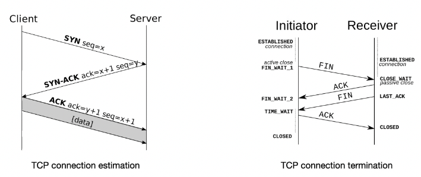

+++
title = 'Networking basics'
+++

# Networking basics
## Domain name system (DNS)
People can't remember IPs, need names that are easy to remember.

Before DNS, you just had a hosts file that was periodically updated via FTP.

DNS:
- distributed, so no centralization and good scalability
- simple client/server architecture via UDP port 53
- hierarchical namespace:
  - root name server by ICANN
    - responsible for root zone file -- lists TLDs and who owns them
    - 13 root servers, globally replicated
    - contacted when names can't be resolved locally
  - top-level domains managed by Verisign and others

Resolving a name via recursive DNS query, e.g. "www.google.com"
- query local DNS server (e.g. dns.vu.nl)
- no entry found, go to root
- root says to contact "com" nameserver
- query "com" NS for "www.google.com"
- "com" NS says to contact "ns1.google.com"
- query "ns1.google.com" for "www.google.com"
- "ns1.google.com" returns IP address

DNS types:
- A (IPv4), AAAA (IPv6): DNS resolution
- CNAME: look for alias
- NS: query for DNS responsible for partial name
- MX: look for mail server

## Socket and TCP
Berkeley sockets:

Transmission control protocol (TCP):
- uses a three-way handshake

TCP functionality:
- reliable delivery: integrity check (header checksum), packet retransmission when lost (sequence number), packet reordering
- flow control: receiver not overrun by sender
- congestion control: network not overrun by sender

## IP routing
IP addresses made up of 32 bits, in groups of 8.
Contain network identifier (IP prefix), subnet identifier, host identifier.

CIDR notation: 10.0.0.1/24
- first 24 bits for network identifier
- rest for host identifier
- alternative subnet mask notation: 255.255.255.0

Generating forwarding tables:
- control plane: routers use distributed protocol to exchange messages and compute shortest paths to other routers
  - OSPF: within domain. routers exchange link-state messages to learn topology, each router uses Dijkstra's to get shortest path, and generates forwarding table entries
  - BGP: between autonomous systems.

MPLS: multiprotocol label switching
- uses a label field, which routers use to forward traffic
- useful for traffic engineering (optimization, performance improvement, etc.)

## Ethernet and ARP
Switched Ethernet:
- switching creates Ethernet segments and forwards frames between them based on MAC address
- Ethernet MAC address: 6 bytes, unique among all network adapters, managed by IEEE
- switches forward/broadcast/drop frames based on switch table
- switches don't need MAC address - they operate transparently to hosts
- generating table:
  - learn new MAC interface mappings through incoming frames
  - if destination MAC unknown, broadcast frame on all interfaces except the one where the frame originated
- store-and-forward: packets received in full, buffered, then forwarded onto output link
- cut-through: when lookup is done, can receive and send packet at the same time (reduces latency, but can't do integrity check)
- redundancy without loops: use logical spanning tree (STP), automatically rebuild on failure
  - with loops, you'd get packets bouncing around constantly
- traffic isolation: VLAN
  - network manager partitions ports into subsets, assigns to VLANs
  - ports in same VLAN form broadcast domain, ports on different VLANs routed through internal router in switch
  - switches connected on trunk ports belonging to all VLANs

ARP: obtaining destination MAC address
- ARP query: ask host with IP to respond with MAC address
- ARP reply: MAC address response sent
- ARP table is cached locally

## Network address translation (NAT)
NAT: way to map IP address space into another, used to mask network changes and prevent running out of IPv4 addresses

From the outside, your IP is the address of your router.
When your router gets traffic, it sends it to the appropriate host on the local network.
