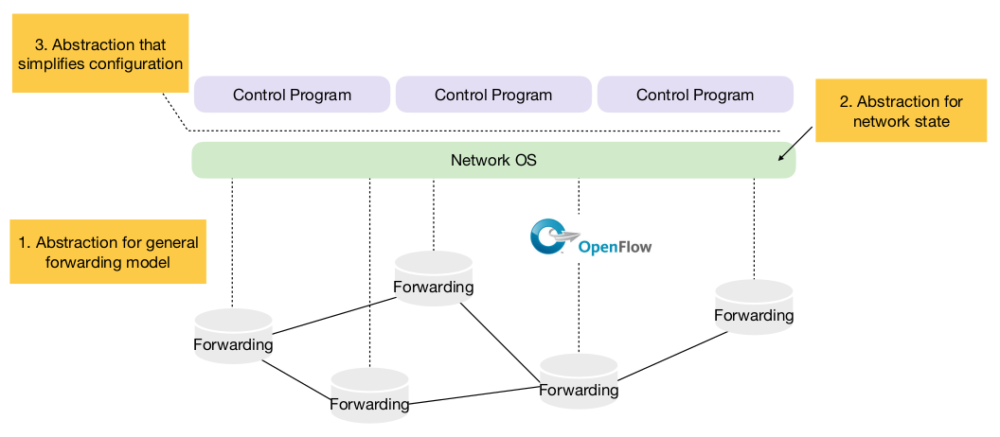

+++
title = 'Software defined networking'
+++

## Software defined networking
Software defined network:
- control plane physically separate from data plane
- single (logically centralized) control plane controls several forwarding devices

Abstractions in SDN:

Forwarding abstraction: OpenFlow
- intent, independent of implementation
- standardized interface to switch
- configuration using flow entries: `<header, action>`
    - match on any header, or new header
    - action: forward to port(s), drop, send to controller, change header, forward at specific bit-rate
      - but no support for payload-related functions

Network state abstraction: "Network Operating Systems"
- annotated network graph provided through API
- runs on servers in network
- information flows from router/switches to form view
- configurations flow to routers/switches to control forwarding

Specification abstraction
- control mechanism express desired behavior
- not responsible for implementing that behavior on physical network infrastructure
- proposed: abstract view of the network

### Network testing (slicing)
Hard to realistically test new network services.

So, slice the network:
- divide production network into logical slices
- users pick which slice controls their traffic (testing is opt-in)
- enforce strong isolation between slices

Slicing policy specifies resource limit for each slice.
- FlowVisor can be used to enforce network slicing, by checking policies

### Composing network control programs
CoVisor is compositional hypervisor for SDN:
- clean interface to compose multiple controllers on same network
- provides operators: parallel (`+`), sequential (`>>`), override (`▷`)
- constraints on individual controllers:
  - visibility (virtual topology for each controller)
  - capability (fine-grained access control)
