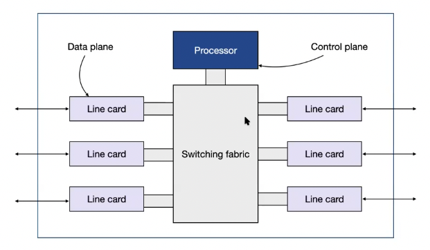
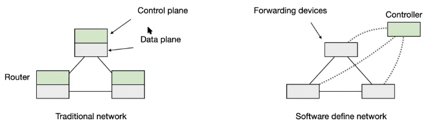
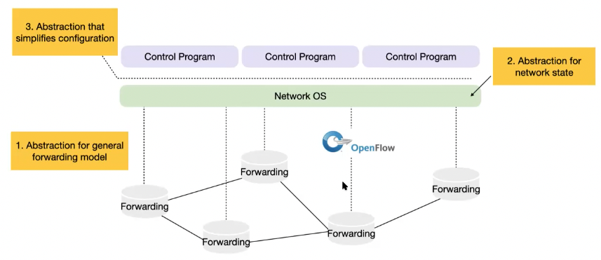
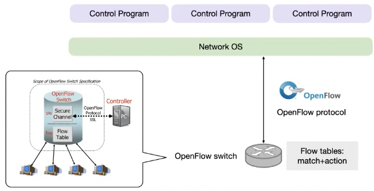
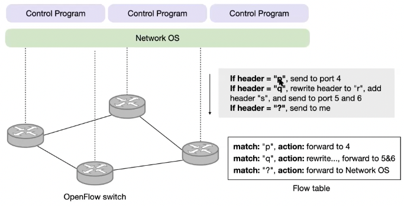
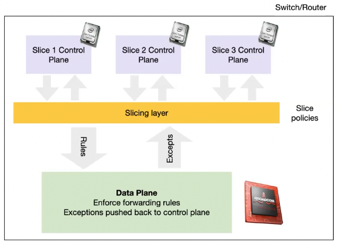
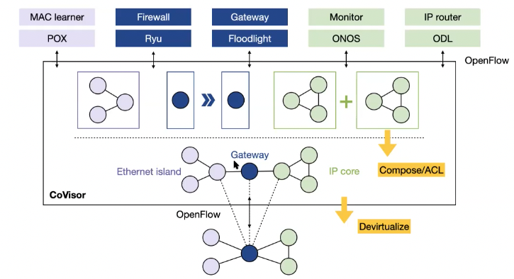

+++
title = 'Software-defined networking'
+++
# Software-defined networking
Network planes:

Control plane has complex goals: connectivity, inter-domain policy, isolation, access control...

We need abstractions to extract simplicity; ultimately we should be able to program the network as we do computers.

First attempt: demultiplexing packets to software programs:
- in-band: packet has small piece of code that can execute on router
- out-band: user injects the code to be executed beforehand

Software-defined network:
- control plane physically separate from data plane
- single control plane controls several forwarding devices

## Abstractions in SDN

### Forwarding - OpenFlow
express intent independent of implementation.

OpenFlow is API for controlling packet forwarding.
Configuration in terms of flow entries `<header, action>`.
No hardware changes needed, only firmware update.

Flow tables
- contain rows of flows
- contain: rule (exact/wildcard) + action + statistics + priority
- match+action
  - match: on arbitrary fields in headers, or new header → allows any flow granularity
  - action: forward to port, or drop, or send to controller, or overwrite header, or forward at specific bit-rate
    - no support for deep packet inspection (payload-related)

### Network state
Global network view is annotated graph, provided through API.
Control program is a function applied on the view (graph).
Implementation is "network operating systems", runs on servers in network.

Info goes both ways:
- info from routers/switches to create view
- configuration to routers/switches to control forwarding

### Specification abstraction
Control mechanism expresses desired behavior, and should not be responsible for implementing it on physical network infrastructure.

Abstract view of network, only enough detail to specify goals.

## SDN for network slicing
It's hard to realistically evaluate new network services.

So, network slicing: divide network into logical slices
- each slice controls its own packet forwarding
- users pick which slice controls their traffic, as opt-in
- existing production services run in their own slice
- enforce strong isolation: actions in one slice do not affect others
- allow this testbed to mirror production network - real hardware, performance, etc.

Slicing policies specify resource limit for each slice (bandwidth, max number of forwarding rules on switches, topology, fraction of switch/router CPU).

For OpenFlow, FlowVisor allows network slicing -- intercepts control messages from OpenFlow to enforce the slicing.
- checks who controls packet/flow
- check if rules allowed or not

## Composing network control programs in SDN
CoVisor is compositional hypervisor:
- clean interface for composing multiple controllers on same network (e.g. POX + Ryu + Floodlight...)

Operators:
- `+`: parallel packet processing
- `>>`: sequential packet processing
- `▷`: overrie, one controller acts or defers processing to another controller

- constraints on individual controllers:
  - network visibility - virtual topology to each controller (so controllers can't operate on whole network)
    - many-to-one primitive: one virtual node to many physical
    - one-to-many primitive: one node in physical, several virtual (e.g. MAC learner + gateway + IP router)
  - packet handling capability - fine-grained access control to each controller
    - constraint on pattern: header fields, match type
    - constrain on action: actions to take on matched packets

Design overview:

