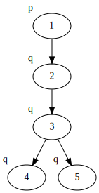
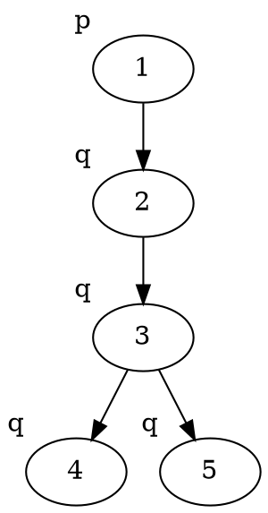
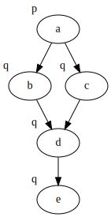
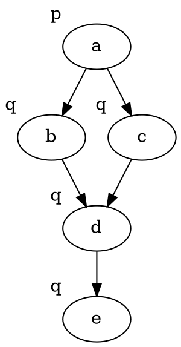

+++
title = 'Bisimulations'
template = 'page-math.html'
+++

# Lecture 4
## Bisimulations
A non-empty relation Z ⊆ W × W' is bisimulation ($Z : M \underline{\leftrightarrow} M'$) if for all pairs (w, w') ∈ Z we have:
- w ∈ V(p) iff w' ∈ V'(p)
- if Rwv then for some v' ∈ W' we have R'w'v' and vZv'
- if R'w'v' then for some v ∈ W we have Rwv and vZv'

Two models are bisimilar ($M \underline{\leftrightarrow} M'$) if there exists a bisimulation Z ∈ W × W'.

Basically, models are bisimilar if they are, in essence, the same (there may be extra states or relations in one of the models but those states/relations do not add any new information compared to the other model). A bisimulation then is the set of states that are bisimilar between two models.

Two pointed models are bisimilar if there exists a bisimulation such that (w,w') ∈ Z

Two states are modally equivalent if they satisfy exactly the same formulas.
So if M,w and M',w' are bisimilar, then they are modally equivalent.

If two states are modally equivalent, then they are bisimilar.

### Example
It's a bit hard to describe this in words, but intuitive if you see it.
Here's an example:

You see that from the top state, you can get to a terminal state in one or two steps, in both models.
Therefore, the top states of both models are _bisimilar_.
Since all of the states in the models are bisimilar, _the two models are bisimilar_.
The dotted lines connect the pairs that make up the _bisimulation_.

### Example: finding bisimulations

Take two example models:

<table>
<thead>
<th>A</th> <th>B</th>
</thead>

<tbody>
<tr>

<td>

Graphviz code

<!-- :Tangle(dot) model-a.dot -->

</td>

<td>

Graphviz code

<!-- :Tangle(dot) model-b.dot -->

</td>

</tr>
</table>

The claim is that states (A,1) and (B,a) are bisimilar.
How do you prove or refute the claim?

Well, we need to find a bisimulation with the pair (1, a).
1. Start with pair (1, a)
2. In A, move from 1 to 2. Have to mimic the move in B, can do so by moving from a to b or from a to c.
    Yields the pairs (2, b) and (2, c).
3. In A, move from 2 to 3. Have to mimic the move in B, can move from both b and c to d.
    Yields the pair (3, d).
4. In A, two options:
    - move from 3 to 4. Have to mimic the move in B, can move from d to e.
        Yields the pair (4, e).
    - move from 3 to 5. Have to mimic the move in B, can move from d to e.
        Yields the pair (5, e).

Since for any move in the first model, we can mimic it in the second model, we have a bisimulation.
The bisimulation contains exactly the pairs we just listed.
So there is a bisimulation Z = {(1, a), (2, b), (2, c), (3, d), (4, e), (5, e)}.
Since (1, a) ∈ Z, we can say that states (A, 1) and (B, a) are bisimilar.

If two states are bisimilar, then they are modally equivalent.
Prove by induction on definition of formulas.

For finitely branching models, if two states modally equivalent, then they are bisimilar.
Prove by taking modal equivalence as bisimulation.

Let Z := {(x, x') | for all φ: x ⊨ φ iff x' ⊨ φ}.
Z is a bisimulation.
- Local harmony is satisfied.
- zig: suppose (x, x') ∈ Z and x → y.
    Because x ⊨ ◇ T also x' ⊨ ◇ T.
    So x' has finitely many successors y'₁...y'n with n ≥ 1.
    Suppose for all i: y is not modally equivalent to y'ᵢ.
    There are φ₁...φn such that y ⊨ φᵢ and y'ᵢ ⊭ φᵢ.
    x ⊨ ◇(φ₁ ∧ ... ∧ φn) so also x' ⊨ ◇ (φ₁ ∧ ... ∧ φn).
    Contradiction.

Asymmetry is not modally definable.
To deal with only frames, we can use surjective bounded morphisms.

Function f : W → W' is bounded morphism from (W,R) to (W',R') if:
- for all w,v ∈ W: if Rwv then Rf(w)f(v)
- for all w ∈ W and for all v' ∈ W': if R'f(w)v' then there exists v ∈ W such that f(v) = v' and Rwv

A bounded morphism f is surjective if for every w' ∈ W' there exists w ∈ W such that f(w) = w'

If f: W → W' is surjective bounded morphism from (W,R) to (W',R'), then if (W,R) ⊨ φ then (W', R') ⊨ φ

### Bisimulation games for two players
Spoiler S claims M,s an N,t to be different.
Duplicator D claims they are similar.

Play consists of sequence of links, starting with link s ~ t.

At current link m ~ n (with m in M and n in N):
- if m an n different in their atoms, then S wins
- if not, then S picks a successor x either of m or of n
- then D has to find a matching transition to y in the other model
- play continues with next link x ~ y (or y ~ x)

If player cannot make a move, he loses.
D wins infinite games.

Modal depth of formulas.
Modal formulas are 'nearsighted':
- md(p) = md(⊥) = md(T) = 0
- md(¬φ) = md(φ)
- md(φ ∨ ψ) = md(φ ∧ ψ) = max{md(φ), md(ψ)}
- md(□ φ) = md(◇ φ) = md(φ) + 1

We need a formula of model depth k to distinguish states x and y.
Spoiler can win bisimulation game in k rounds.
Every winning strategy for Spoiler corresponds to a distinguishing formula.
Games of less than k rounds can be won by Duplicator.
Formulas of modal depth less than k cannot distinguish between x and y.

M,s and N,t satisfy the same formulas up to modal depth k iff duplicator has winning strategy in the k-round game starting in s ~ t.
If Spoiler can win in k rounds, then there is a distinguishing formula of modal depth k.
