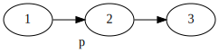
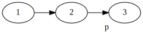
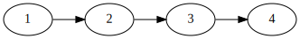
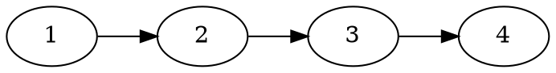
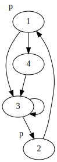
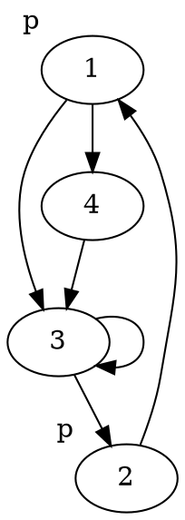
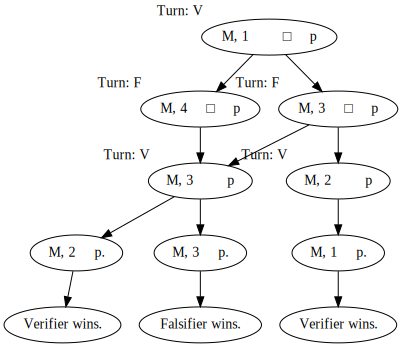
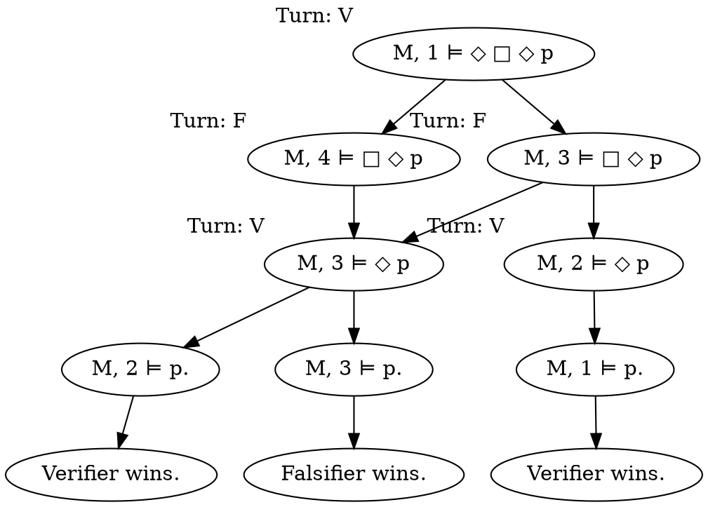

+++
title = 'Exercise class 1'
+++
# Exercise class 1
## Universal validity examples
- □ φ → ◇ φ

  Not universally valid, see model with one point & no relations.
  Has □ p but not ◇ p.

- ◇ φ → □ φ

  Not universally valid.

  Counterexample:
  - W = {1,2}. R = {(1,1), (1,2)}. V(p) = {1}.
  - Show ◇ p → □ p.
  - (W,R),V,1 ⊨ ◇ p because R11 and 1 ⊨ p.
  - But 1 ⊭ □ p because R12 and 2 ⊭ p.
  - So not universally valid.

- □ p → □ □ p

  No.
  Counterexample when left side of implication holds but right does not:

  

  <details>
  <summary>Dot code</summary>

  ```dot
  digraph g {
    rankdir="LR"
    2 [label="2", xlabel="p"]
    1 -> 2
    2 -> 3
  }
  ```

  </details>

- ¬ □ p → □ ¬ □ p

  No.
  Counterexample:

  

  <details>
  <summary>Dot code</summary>

  ```dot
  digraph g {
    rankdir="LR"
    3 [label="3", xlabel="p"]
    1 -> 2
    2 -> 3
  }
  ```

  </details>

## 1
### 1a
W = {a₁...a₇}. R = {(a₁, a₂), (a₁, a₃), ...}. V(p) = {a₁, a₂...}, V(q) = {a₂, a₃...}.

Valuation can also be written as V(a₁) = {p}, etc.

### 1b
#### 1b i
M, a₁ ⊨ □ □ (p ∨ q)
- R[a₁] = {a₂, a₃, a₄} (the successors of a₁).
- Holds by looking at the picture.

#### 1b ii
M, a₂ ⊨ ◇ q → ◇ ◇ q
- R[a₂] = {a₅}.
- Since a₅ ⊭ q, then a₂ ⊭ ◇ q.
- So formula holds because ◇ q doesn't hold. <!-- TODO: really? -->

### 1d
Change V by making p true in all states.

## 3
### 3a
⊨ □ (p → q) → (◇ p → ◇ q)
- Take an arbitrary pointed model (W,R),V,x.
- Assume x ⊨ □ (p → q), aim to show x ⊨ ◇ p → ◇ q.
- Assume x ⊨ ◇ p, aim to show x ⊨ ◇ q.
- x ⊨ ◇ p so x has a successor: there is y ∈ W such that y ⊨ p and Rxy.
- Because Rxy, we have x ⊨ ◇ q.
- So x ⊨ ◇ p → ◇ q.
- So x ⊨ □ (p → q) → (◇ p → ◇ q).
- Because x is arbitrary, the formula is universally valid.

Remember: □ φ is true if no successor, ◇ φ is false if no successor.

### 3b
⊨ □ (p ∧ q) → (◇ p ∧ ◇ q)
- Not valid with a singleton state and no relations. Premise is true, but not the right-hand side.

### 3c
□ (□ p → p) → □ p

No.
Counterexample:



<details>
<summary>Dot code</summary>



</details>

## 4
First, draw a picture:



<details>
<summary>Dot code</summary>



</details>

Then, create a tree:



<details>
<summary>Dot code</summary>



</details>

We cannot influence falsifier here since we play as verifier (trying to show that it hols).
But no matter what falsifier does, verifier has a winning strategy.

