+++
title = 'Exercise class 3'
+++

# Exercise class 3
## Exercise 1
The two models:

<table>
<tr>
<th>M</th>
<th>K</th>
</tr>
<tr>
<td>
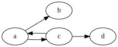

<details>
<summary>Graphviz code</summary>

<!-- :Tangle(dot) 1-model-m.dot -->
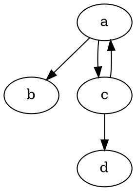

</details>

</td>
<td>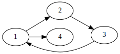

<details>
<summary>Graphviz code</summary>

<!-- :Tangle(dot) 1-model-k.dot -->
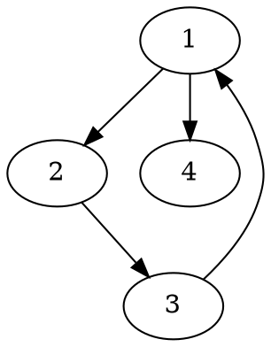

</details>
</td>
</tr>
</table>

### a)

| Round | S      | D            | link  | local harmony |
|-------|--------|--------------|-------|---------------|
| 0     |        |              | a ~ 1 | ok            |
| 1     | a -> c | (1/2) 1 -> 2 | c ~ 2 | ok            |
| 2     | c -> d | 2 -> 3       | d ~ 3 | ok            |
| 3     | 3 -> 1 | stuck.       |       |               |
| ...   | ...    | ...          | ...   | ...           |
| 1     | a -> c | (2/2) 1 -> 4 | c ~ 4 | ok            |
| 2     | c -> a | stuck.       |       |               |

So even in an optimal game, D gets stuck.
Therefore, M,a and K,1 are not bisimilar.

Once we find a winning strategy for S no matter what D does, we can stop.

### b)
A formula distinguishing M,a and K,1 is: ◇ ◇ □ ⊥

In two steps, we reach a blind state.

## Sequents and tableaux (exercise 5)
### □ p → ◇ p
Show validity of: □ p → ◇ p

Pre-processing:

```
□ p → ◇ p ≡ ¬ □ p ∨ ◇ p
          ≡ ◇ ¬ p ∨ ◇ p
```

<table>
<tr><th>Sequent</th><th>Tableau</th></tr>
<tr>
<td>

```
⇒ ◇ ¬ p ∨ ◇ p
⇒ ◇ ¬ p, ◇ p
```

Stuck. No diamond on left, so cannot take a step.

◇ ¬ p ∨ ◇ p not valid, so □ p → ◇ p not valid.
</td>
<td>
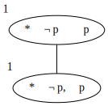

Zero non-solid successors. Stuck, does not close, so non-validity.

Counter-model F = ({1}, ∅), V(p) = ∅.

<details>
<summary>Graphviz code</summary>

<!-- :Tangle(dot) 5-1-tableau.dot -->
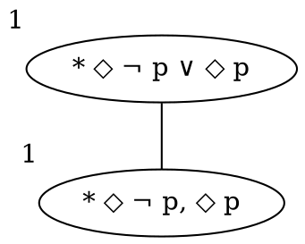

</details>

</td>
</tr>
</table>

### □ (p → q) → (□ p → □ q)
Show validity of: □ (p → q) → (□ p → □ q)

Pre-processing:

```
□ (p → q) → (□ p → □ q) ≡ ¬ ◇ ¬ (¬ p ∨ q) → (¬ ◇ ¬ p → ¬ ◇ ¬ q)
                        ≡ ◇ ¬ (¬ p ∨ q) ∨ (◇ ¬ p ∨ ¬ ◇ ¬ q)
                        ≡ ◇ (p ∧ ¬ q) ∨ ◇ ¬ p ∨ ¬ ◇ ¬ q
```

<table>
<tr> <th>Sequent</th> <th>Tableau</th> </tr>
<tr>
<td>

```
⇒ ◇ (p ∧ ¬ q), ◇ ¬ p, ¬ ◇ ¬ q
◇ ¬ q ⇒ ◇ (p ∧ ¬ q), ◇ ¬ p

One case:
¬ q ⇒ p ∧ ¬ q, ¬ p
p, ¬ q ⇒ p ∧ ¬ q
p ⇒ p ∧ ¬ q, q

Two goals, both must be valid:
    A) p ⇒ p, q
       Valid.
    B) p ⇒ ¬ q, q
       p, q ⇒ q
       Valid.

Sequent is valid, so initial formula is valid.
```

</td>
<td>
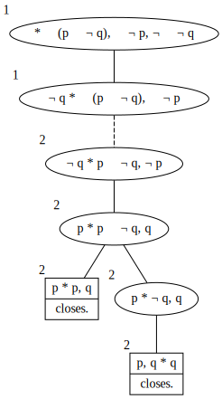

Closes, so initial formula is valid.

<details>
<summary>Graphviz code</summary>

<!-- :Tangle(dot) 5-2-tableau.dot -->
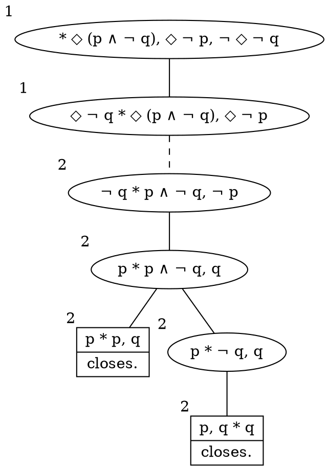

</details>

</td>
</tr>
</table>

### (□ p → □ q) → □ (p → q)
Show validity of: (□ p → □ q) → □ (p → q)

Pre-processing:

```
(□ p → □ q) → □ (p → q) ≡ (¬ ◇ ¬ p → ¬ ◇ ¬ q) → ¬ ◇ ¬ (¬ p ∨ q)
                        ≡ ¬ (◇ ¬ p ∨ ¬ ◇ ¬ q) ∨ ¬ ◇ (p ∧ ¬ q)
                        ≡ (¬ ◇ ¬ p ∧ ◇ ¬ q) ∨ ¬ ◇ (p ∧ ¬ q)
```

Tableau:

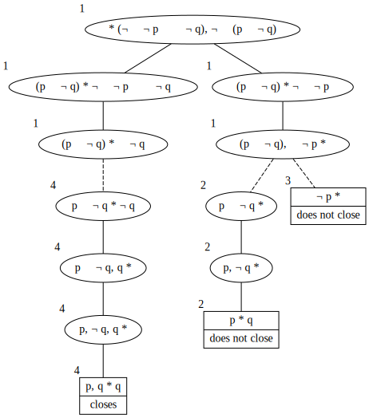

<details>
<summary>Graphviz code</summary>

<!-- :Tangle(dot) 5-3-tableau.dot -->
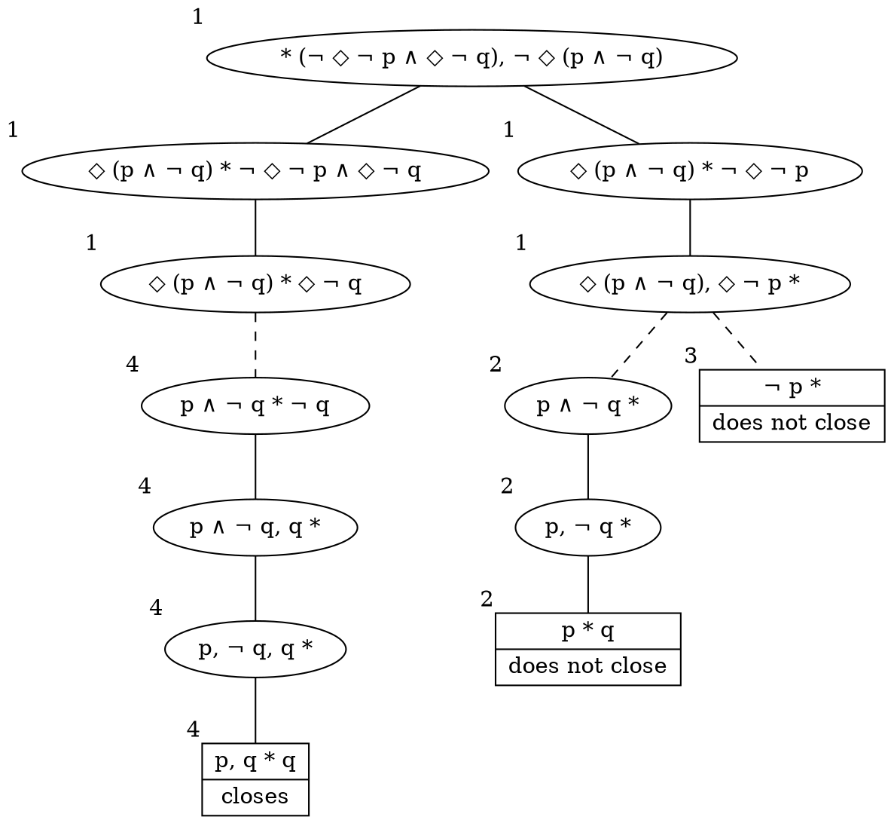

</details>

This yields a counter-model:

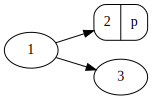

<details>
<summary>Graphviz code</summary>

<!-- :Tangle(dot) 5-3-counter-model.dot -->
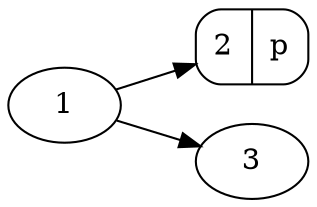

</details>

1 ⊭ □ (p → q) because 2 ⊭ p → q.
But 1 ⊨ (□ p → □ q) because 1 ⊭ □ p.
