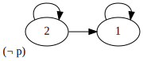
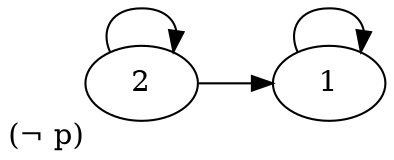

+++
title = 'Exercise 4'
+++
# Exercise 4
"show that x not derivable": use soundness and completeness.
show that there is frame in the right class.

¬ □ ¬ □ p → p not derivable in S4 (I think reflexive + transitive)

Graphviz code

<!-- :Tangle(dot) diagram.dot -->

Derivation of ¬ □ ¬ □ p → p in S5:
1. S5 has as axiom ¬ □ p → □ ¬ □ p
2. ¬ □ ¬ □ p → □ p. prop contrapositive 1
3. □ p → p. axiom A1.
4. ¬ □ ¬ □ p → p. prop 2, 3.

## Exercise sheet 5
### 1a
N = (ℕ, <). ◇ □ p → □ ◇ p?
1. take arbitrary valuation for N, M=(N,V).
2. Take M ∈ N.
3. Assume n ⊨ ◇ □ p. Goal to show n ⊨ □ ◇ p.
4. Take x arbitrary successor of n. Goal x ⊨ ◇ p.
5. x + n > x and x + n ⊨ p.
6. So x ⊨ ◇ p...and so the formula valid.

### 4b
Until is not modally definable in BML.
* Until defined with M,t ⊨ φ U ψ ↔ ∃ v, t < v, v ⊨ ψ, ∀x t < x < v and x ⊨ φ.
* temporal frame, so irreflexive and transitive

Proof:
- create two models M where a ⊨ p U q, M' where a' ⊭ p U q.
- claim bisimilar by giving bisimulation, states a and a'.
- because a and a' bisimilar, are modally equivalent.
- suppose that until is definable in BML by a formula ζ(x, y)
- then we have a ⊨ p U q, so a ⊨ ζ(p, q). Opposite for a'.
- contradiction, a and a' modally equivalent but satisfy different formulas (i.e. a ⊨ ζ but a' ⊭ ζ).
