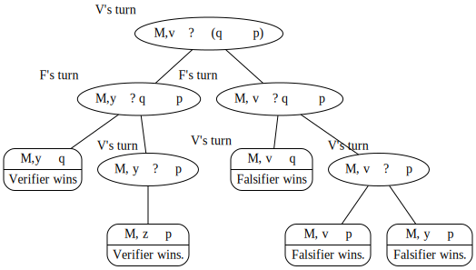
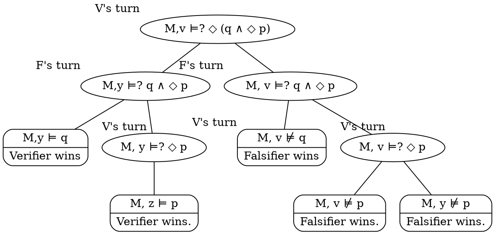
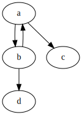
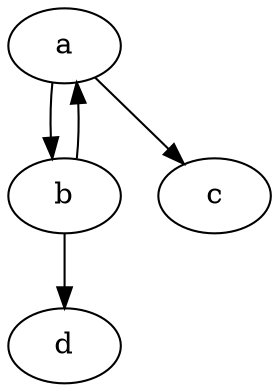
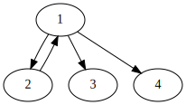
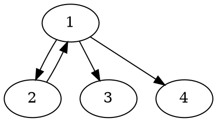
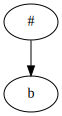
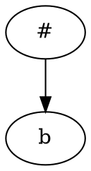

+++
title = 'Homework 1'
+++
# Homework 1
## 1
### a
- We aim to show M,v ⊨ ◇ (q ∧ ◇ p).
- For the formula to hold, (q ∧ ◇ p) must hold in at least one successor of v.
- v has two R-successors: v and y.
- q ∧ ◇ p does not hold in v, because v ⊭ q.
- However, y ⊨ q ∧ ◇ p: y ⊨ q, and Ryz and z ⊨ p, thus y ⊨ ◇ p.
- Therefore, M,v ⊨ ◇ (q ∧ ◇ p).

### b

If Verifier chooses the left branch (M, y ⊨ q ∧ ◇ p), he always wins.

Graphviz code

<!-- :Tangle(dot) game-tree.dot -->

## 2
### a
- Goal is to show ⊨ (◇ p → □ q) → (□ p → □ q).
- Take an arbitrary frame F = (W,R), V a valuation on F, and x ∈ W. Let M = (F, V).
- Assume M, x ⊨ (◇ p → □ q), where M = (F, V).
- Aim to show M, x ⊨ □ p → □ q.
- Assume M, x ⊨ □ p, aim to show M, x ⊨ □ q.
- If x has no successors, ◇ p does not hold, hence M, x ⊨ □ q ex falso (also by assumption).
- If x has successors, and p is valid in at least one of them, x ⊨ ◇ p, hence M, x ⊨ □ q by assumption.
- If x has successors, an p is not valid in any of them, x ⊨ □ q because ◇ p is not valid in x.
- Because the model and state are arbitrary, the formula is universally valid.

### b
- Goal is to show ⊨ ¬ ◇ □ p → ◇ ◇ ¬ p.
- Consider the frame F = ({x}, ∅) and valuation V(p) = ∅.
- In state x, ◇ □ p is not valid, because x has no successors, hence x ⊨ ¬ ◇ □ p.
- However, since x has no successors, x ⊭ ◇ ◇ ¬ p.
- Therefore, the implication doesn't hold, and the formula is not universally valid.

## 3
We aim to show that F ⊨ p → □ ◇ p iff F is symmetric: ∀ x, y ∈ W (Rxy → Ryx).

* Assume that in a frame F = (W,R), F ⊨ p → □ ◇ p.
    - Assume towards a contradiction that F is not symmetric.
    - Then there must be states x, y ∈ W such that Rxy but not Ryx.
    - Take a model M = (F, V), with valuation V(p) = {x}.
    - Then, M, x ⊨ p.
    - x has successor y, but y does not have x as a successor, therefore M, y ⊭ p → □ ◇ p, so F ⊭ □ ◇ p.
    - This contradicts the assumption.

* Assume that a frame F = (W, R) is symmetric.
    - We aim to show that F ⊨ p → □ ◇ p.
    - Take an arbitrary model M = (F, V) and an arbitrary state x ∈ M.
    - Assume that M, x ⊨ p and aim to show M, x ⊨ □ ◇ p.
    - If x has no successors, then x ⊨ □ ◇ p.
    - If there is y ∈ W such that Rxy, then we must also have Ryx by the assumption that F is symmetric.
    - Because x ⊨ p and y ⊨ p, x ⊨ □ ◇ p and y ⊨ □ ◇ p.
    - Because the state x and the model M are arbitrary, F ⊨ □ ◇ p.

* We have therefore shown that the formula p → □ ◇ p characterizes the frame property "symmetry".

## 4
### a

<table>
<tr> <th>Model A</th> <th>Model B</th> <th>Model C</th> </tr>
<tr>

<td>

Graphviz code

<!-- :Tangle(dot) model-a.dot -->

</td>

<td>

Graphviz code

<!-- :Tangle(dot) model-b.dot -->

</td>

<td>

Graphviz code

<!-- :Tangle(dot) model-c.dot -->

</td>
</tr>
</table>

### b
- A, a ⊨ ◇ ◇ □ ⊥, but B, 1 ⊭ ◇ ◇ □ ⊥.
- A, d ⊨ □ ⊥, so A, b ⊨ ◇ □ ⊥, so A, a ⊨ ◇ ◇ □ ⊥.
- B, 4 ⊨ □ ⊥, so B, 1 ⊨ ◇ □ ⊥ but only B, 2 ⊨ ◇ ◇ □ ⊥, not state 1.

### c
Because the states a ∈ A and 1 ∈ B are not modally equivalent as shown in exercise 4b above.

### d
Take the set Z = {(a, #), (b, #), (c, b), (d, b)}.
We claim that Z is a bisimulation, and (a, #) ∈ Z, therefore they are bisimilar.
No proof is necessary here.
