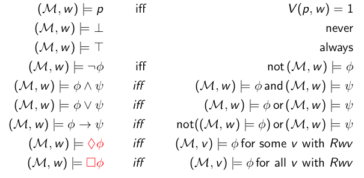
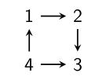

+++
title = 'Intro to Modal Logic (operators, frames, models, tautologies)'
+++

# Intro to Modal Logic (operators, frames, models, tautologies)
## First-order propositional logic
Includes variables, T, ⊥, not, and, or, implication.
Proofs are given by structural induction.
Precedence is ¬, then ∧∨, then →.

a valuation v : Var → {0,1} maps propositional variables to truth values.
i.e., it tells you what variables are true.

the semantics of a formula under a valuation is defined with pᵥ = v(p), with p ∈ Var

if φᵥ = 1 (i.e. φ is true in v), we write v ⊨ φ (read "v models φ").
- then also: φ has a model, namely the model with state _v_, so φ is _satisfiable_

If every model of all φᵢ is a model of ψ, we write φ₁,...,φn ⊨ ψ
- then ψ is a semantic consequence of φ₁,...,φn

If v ⊨ φ for all valuations of v, then universally ⊨ φ (φ is a tautology)

Soundness: ⊢ implies ⊨ ("what we can derive is true"). proved by induction on length of proof

Completeness: ⊨ implies ⊢ ("what is true can be derived"). can be proven using consistency

## Basic modal logic
Basic model logic operators:
- □: necessary, known, provable
- ◇: possible, considered possible

In a diagram, one of these symbols is exactly one transition step (use multiple for multiple steps).

- ◇ φ ⇔ ¬□ ¬φ
- □ φ ⇔ ¬◇ ¬φ

Examples in natural language:
- "whatever is necessary is possible" == □φ → ◇φ
- □ can also mean "I know", e.g. "I know that someone appreciates me" == ∃x.□A(x, M)

Loeb's formula: □ (□ p → p) → □ p

Veridicality: □ φ → φ

Truth is relative to current situation/world/environment:
- formulas evaluated in given structure (i.e. world, model, frame, or universally)
- necessity (□): truth in all accessible worlds. if there are no accessible worlds, it's true.
    - □ T: holds always
    - □ ⊥: holds in blind states (those without a successor)
- possibility (◇): truth in some accessible world (at least one). if there are no accessible worlds, it's false.
    - ◇ ⊥: never holds (can never do a step to a state where ⊥ holds)
    - ◇ T: holds in states with a successor

Dualities:
- ◇ φ ≡ ¬ □ ¬ φ
- □ φ ≡ ¬ ◇ ¬ φ

## Frames
A situation is set by a frame F = (W,R)
- W ≠ ∅ set of possible worlds/states
- R ⊆ W × W an accessibility/transition relation

A frame is just the states and transitions between them, without a valuation (i.e. without saying what's true in each state).

A frame could be (ℕ, <), or ({1,2,3,4}, {(1,2), (2,4), (1,3), (3,4), (2,2)})

## Models
model: pair M = (F, V)
- a frame F = (W,R)
- a valuation V : Var → W → {0,1}, or V : Var → P(W)
    - the valuation says which letters/formulas are true in which states
    - possible notation:
        - V : Var → P(W) means Var → W → {0,1}
        - V(p,w) = 1 is the same as w ∈ V(p)

pointed model: pair (M,w) of model M and w a world in M (i.e. you zoom in to a specific state in M)

## Distinguishing and characterizing states
A formula φ _characterizes_ a state x in model M if φ is true in x but not in other states of M.

A formula φ _distinguishes_ state x from state y in a model M if φ is true in x but not in y.

Example

Above:
- the formula 3 ⊨ □ ⊥ characterizes state 3
- the formula 2 ⊨ ◇ □ ⊥ characterizes state 2

