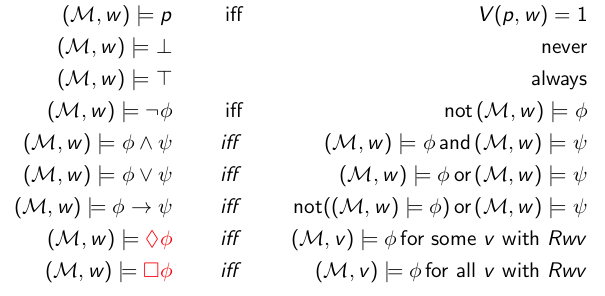

+++
title = 'Lecture 1'
+++

# Intro

Basic model logic operators:
- □: necessary, known, provable
- ◇: possible, considered possible

In a diagram, one of these symbols is exactly one transition step (use multiple for multiple steps).

- ◇ φ ⇔ ¬□ ¬φ
- □ φ ⇔ ¬◇ ¬φ

# First-order propositional logic
Includes variables, T, ⊥, not, and, or, implication.
Proofs are given by structural induction.
Precedence is ¬, then ∧∨, then →.

a valuation v : Var → {0,1} maps propositional variables to truth values.

the semantics of a formula under a valuation is defined with pᵥ = v(p), with p ∈ Var

if φᵥ = 1, we write v ⊨ φ (read "v models φ")
- then, φ has a model, so φ is satisfiable

If every model of all φᵢ is a model of ψ, we write φ₁,...,φn ⊨ ψ
- then ψ is a semantic consequence of φ₁,...,φn

If v ⊨ φ for all valuations of v, then ⊨ φ (φ is a tautology)

Soundness: ⊢ implies ⊨, proved by induction on length of proof

Completeness: ⊨ implies ⊢, can be proven using consistency

# Basic modal logic
E.g. "whatever is necessary is possible" == □φ → ◇φ

□ can also mean "I know", e.g. "I know that someone appreciates me" == ∃x.□A(x, M)

Loeb's formula: □ (□ p → p) → □ p

Veridicality: □ φ → φ

Truth s relative to current situation/world/environment:
- formulas evaluated in given structure
- necessity: truth in all accessible worlds
- possibility: truth in some accessible world (at least one)

## Frames
A situation is set by a frame F = (W,R)
- W ≠ ∅ set of possible worlds/states
- R ⊆ W × W an accessibility/transition relation

A frame could be (ℕ, <), or ({1,2,3,4}, {(1,2), (2,4), (1,3), (3,4), (2,2)})

## Models
model: pair M = (F, V)
- a frame F = (W,R)
- a valuation V : Var → W → {0,1}, or V : Var → P(W)

pointed model: pair (M,w) of model M and w a world in M

◇T holds if at least one successor.
□⊥ holds if there is no successor.

Dualities:
- ◇ φ := ¬ □ ¬ φ
- □ φ := ¬ ◇ ¬ φ
