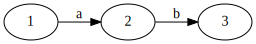
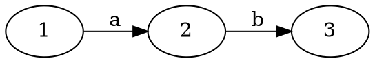

+++
title = 'Lecture 10'
+++
# Lecture 10
## Multi-modal logic
Assume set of labels I (which in a diagram are on the arrows).
For every label i there is modality 〈i〉 so the formulas of multi-modal logic are, given I, defined for i in ∈ I.

I-frame is pair (W, {Rᵢ | i ∈ I}).
Rᵢ ⊆ W × W for every i ⊆ I.

I-model is triple (W, {Rᵢ | i ⊆ I}, V).

### Truth and validity
For M an I-model, M,w ⊨ φ is defined by induction on the definition of formulas.

Clauses:
- M,w ⊨ 〈a〉φ iff M,v ⊨ φ for some v with Rₐwv
- M,w ⊨ [a]φ iff M,v ⊨ φ for all v with Rₐwv

### Example
Use index set I = {a, b, c}.
Give model with a world where the formula 〈a〉(〈b〉[a] p ∧ [c] ¬ 〈a〉p) is true.

Graphviz code

<!-- :Tangle(dot) example-multimodal-logic-formula.dot -->

For a bisimulation, when you do a step between states, they have to be with the same label (so the mimic step must have the same label).

### Geach axiom
◇ □ p → □ ◇ p.

Valid in frame iff for every r ← s → u there is r → v ← u.

## Program correctness
Prove that a program meets its specification.

Correctness specification: formal description of how program is supposed to behave

Program is correct: its executions satisfy the specification

### Verification - Hoare approach
Prove statements of form `{precondition} program {postcondition}`
- pre/postcondition are formulas
- program is a while-program
- we have proof rules for showing {φ} α {ψ}

Partial correctness: if program starts satisfying φ, and if it halts, then when it halts ψ is satisfied

Total correctness: partially correct, and terminates whenever started while satisfying φ
