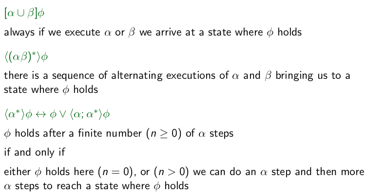

+++
title = 'Lecture 11'
+++
# Lecture 11
In propositional dynamic logic (PDL), aim to prove: φ → [while σ do α] ψ
- i.e. starting with φ true, for any terminating execution of the program, we have ψ true.

Definitions:
- state of program execution: state/world
- program: regular program which slightly generalizes a while program
- statement {pre}program{post}: formula pre → [program] post

For every program α we have modality \<α\>:
- \<α\>: it's possible to execute α from current state, and successfully halt in state satisfying φ (like existential quantification)
- [α]φ: for all executions of α, if α successfully halts, then it halts in a state satisfying φ (like universal quantification)

Program definitions:
- a: program from set A of atomic programs (letters, like in prop. logic)
- α; β: sequential composition
- α ∪ β: non-deterministic choice
- α\*: iteration, 0 or more times.
- φ?: test, depends on the grammar for formulas
    - if φ then continue without changing state, if not then block without halting

Examples of formulas:

We obtain semantics of PDL as instance of multi-modal logic.
