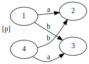
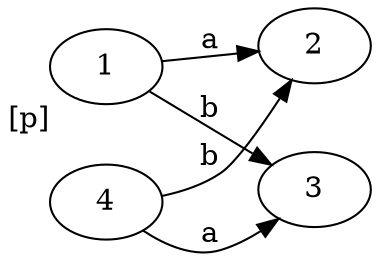
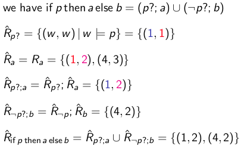
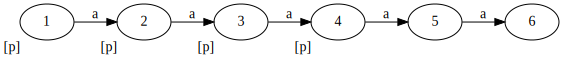
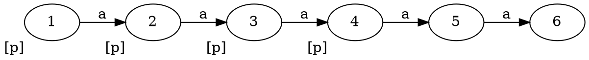
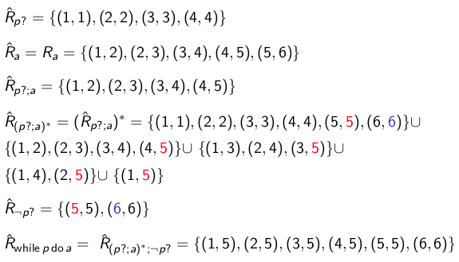

+++
title = 'Lecture 12'
template = 'page-math.html'
+++
# Lecture 12
- composition "R;S" = {(x, z) | ∃ y : Rxy ∧ Syz}
- union "R ∪ S" = {(x, y) | Rxy ∨ Sxy}
- R\*: repeat R one or more times

A model M is a PDL-model if the frame is a PDL-frame and $R_{\phi ?} = \\{ (w,w) \\;|\\; M, w \models \phi\\}$

The R of the frame is all sets of Rₐ where _a_ is a program (i.e. a label on an arrow).

Proof example of 〈α, β〉 p → 〈α〉〈β〉p

- Take a PDL model and a state x.
- Assume x ⊨ 〈α, β〉 p
- That is, there is a state y such that $(x, y) \in R_{\alpha;\beta}$ and y ⊨ p.
- $R_{\alpha;\beta} = R_{\alpha}; R_{\beta}$
- That is, there is a state u such that $(x, u) \in R_{\alpha}$ and $(u,y) \in R_{\beta}$.
- Because $(u,y) ∈ R_{\beta}$ and y ⊨ p, we have u ⊨ 〈β〉 p
- Because $(x,u) ∈ R_{\alpha}$, we have and u ⊨ 〈β〉p we have x ⊨ 〈α〉〈β〉p.

If then else:
- program: `if p then a else b`
- encoding: (p?; a) ∪ (¬ p? ; b)

Example

Graphviz code

<!-- :Tangle(dot) model-if-then-else.dot -->

Calculate the relation for `if p then a else b`, which is encoded as `(p?; a) ∪ (¬ p?; b)`:

While:
- program: `while p do a`
- encoding: (P?; a)\*; ¬ p?

Example

Graphviz code

<!-- :Tangle(dot) model-while.dot -->

Calculating the relation `while p do a`, encoded as `(p?; a)*; ¬ p?`:

If E is a bisimulation between two A-models, then it is a bisimulation for the models' PDL-extensions.
