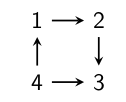
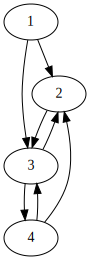
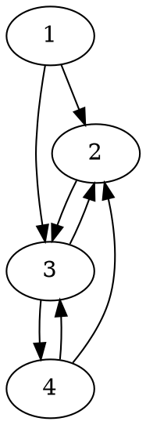
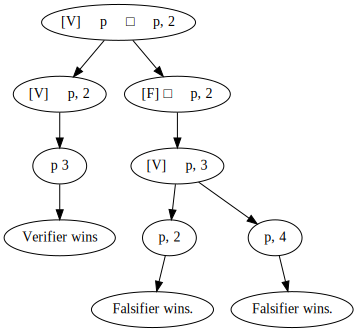
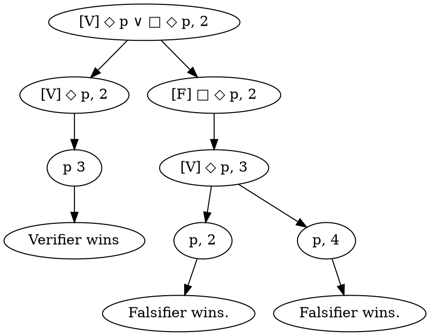

+++
title = 'Lecture 2'
+++
# Lecture 2
## Semantics: local truth
Valuation notation:
- V : Var → P(W) means Var → W → {0,1}
- V(p,w) = 1 is the same as w ∈ V(p)

A formula φ _characterizes_ a state x in model M if φ is true in x but not in other states of M.

A formula φ _distinguishes_ state x from state y in a model M if φ is true in x but not in y.

Above:
- the formula 3 ⊨ □ ⊥ characterizes state 3
- the formula 2 ⊨ ◇ □ ⊥ characterizes state 2

## Game semantics
We have:
- model M = ((W,R), V), world w ∈ W, formula φ
- two players:
    - Verifier V claims that φ is true in w (sort of like ∀)
    - Falsifier F claims that φ is false in w (sort of like ∃, try to find a _witness_)
- position: pair (w, φ) with w ∈ W a world and φ a formula
- move: from position (w, φ), determined by main operator of φ

Assume that negation only applied to prop. variables.
Transform formulas from ¬ □ p to ◇ ¬ p, ¬(p ∧ q) to ¬p ∨ ¬q.

The position determines the move, e.g. in a position (t, ◇ φ), V chooses a successor _u_ of _t_, and play continues with (u, φ).
For (t,p), if p is true in t then V wins, otherwise F wins.
For (t, ¬p), if p is false in t then V wins, otherwise F wins.
If a player should but cannot choose a successor, they lose.

Who starts:
- V: ∨, ◇
- F: ∧, □

A complete game tree for φ and (M,w) starts with (w,φ) and contains all possible moves.
A strategy for player P is subset of steps for P, and it's a winning strategy if it ensures that P wins the game.
φ is true in M in s ⇔ V has a winning strategy for M,s,φ.

### Example
Diagram:

Dot code

Generated with PlantUML, surround it with `@startdot` and `@enddot`.

Given:
- formula ◇ p ∨ □ ◇ p, in state 2.
- p is true in state 3.

Complete game tree:

Dot code

Generated with PlantUML, surround it with `@startdot` and `@enddot`.

## Truth and validity
(((W,R),V),w) ⊨ φ means φ is valid in a point w.
(W,R) ⊨ φ means φ is valid in a frame (W,R).
⊨ φ means φ is valid/tautology.
If a part is omitted, it's implicitly universally quantified.

Satisfiability:
- φ _satisfiable in model M_ if there's a world w ∈ M such that M,w ⊨ φ
- φ _satisfiable_ if there's a model M and a world w ∈ M such that M,w ⊨ φ
- φ and ψ _semantically equivalent_ if ∀ M,w: M,w ⊨ φ ⇔ M,w ⊨ ψ
- φ valid iff ¬ φ not satisfiable

### Example
Show universal validity of □ (φ → ψ) → (□ φ → □ ψ)

1. let F = (W,R) be frame, V valuation on F, let x ∈ W.
2. Assume a1: F,V,x ⊨ □ (φ → ψ)
3. Assume a2: F,V,x ⊨ □ φ
4. Aim to show F,V,x ⊨ □ ψ.
5. □ is universal quantification, so take an arbitrary successor y ∈ W.
6. If Rxy, aim to show y ⊨ ψ. If not, we are one.
7. Have y ⊨ φ → ψ and y ⊨ φ.
8. From a2, have y ⊨ φ.
9. From a1, have have y ⊨ ψ.
10. Hence x ⊨ □ ψ, hence x ⊨ □ φ → □ ψ. Hence formula is valid.
