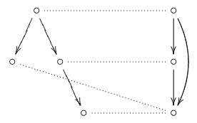
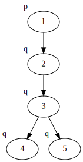
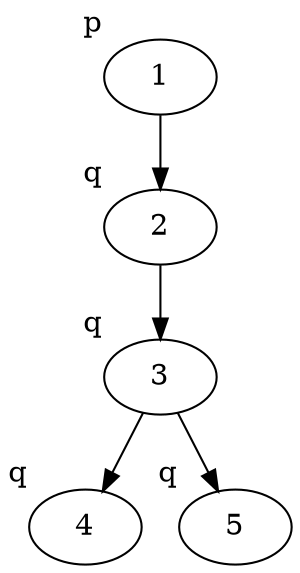
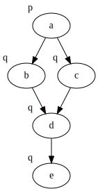
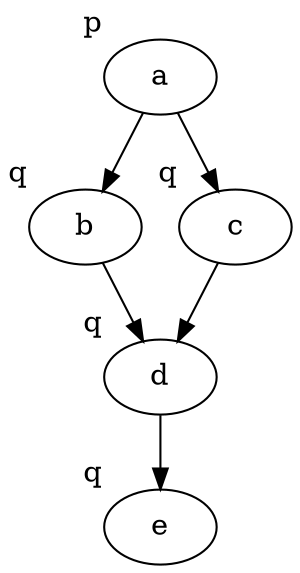

+++
title = 'Lecture 4'
template = 'page-math.html'
+++

# Lecture 4
## Bisimulations
A non-empty relation Z ⊆ W × W' is bisimulation ($Z : M \underline{\leftrightarrow} M'$) if for all pairs (w, w') ∈ Z we have:
- w ∈ V(p) iff w' ∈ V'(p)
- if Rwv then for some v' ∈ W' we have R'w'v' and vZv'
- if R'w'v' then for some v ∈ W we have Rwv and vZv'

Two models are bisimilar ($M \underline{\leftrightarrow} M'$) if there exists a bisimulation Z ∈ W × W'.

Basically, models are bisimilar if they are, in essence, the same (there may be extra states or relations in one of the models but those states/relations do not add any new information compared to the other model). A bisimulation then is the set of states that are bisimilar between two models.

Two pointed models are bisimilar if there exists a bisimulation such that (w,w') ∈ Z

Two states are modally equivalent if they satisfy exactly the same formulas.
So if M,w and M',w' are bisimilar, then they are modally equivalent.

If two states are modally equivalent, then they are bisimilar.

### Example
It's a bit hard to describe this in words, but intuitive if you see it.
Here's an example:

You see that from the top state, you can get to a terminal state in one or two steps, in both models.
Therefore, the top states of both models are _bisimilar_.
Since all of the states in the models are bisimilar, _the two models are bisimilar_.
The dotted lines connect the pairs that make up the _bisimulation_.

### Example: finding bisimulations

Take two example models:

<table>
<thead>
<th>A</th> <th>B</th>
</thead>

<tbody>
<tr>

<td>

Graphviz code

<!-- :Tangle(dot) model-a.dot -->

</td>

<td>

Graphviz code

<!-- :Tangle(dot) model-b.dot -->

</td>

</tr>
</table>

The claim is that states (A,1) and (B,a) are bisimilar.
How do you prove or refute the claim?

Well, we need to find a bisimulation with the pair (1, a).
1. Start with pair (1, a)
2. In A, move from 1 to 2. Have to mimic the move in B, can do so by moving from a to b or from a to c.
    Yields the pairs (2, b) and (2, c).
3. In A, move from 2 to 3. Have to mimic the move in B, can move from both b and c to d.
    Yields the pair (3, d).
4. In A, two options:
    - move from 3 to 4. Have to mimic the move in B, can move from d to e.
        Yields the pair (4, e).
    - move from 3 to 5. Have to mimic the move in B, can move from d to e.
        Yields the pair (5, e).

Since for any move in the first model, we can mimic it in the second model, we have a bisimulation.
The bisimulation contains exactly the pairs we just listed.
So there is a bisimulation Z = {(1, a), (2, b), (2, c), (3, d), (4, e), (5, e)}.
Since (1, a) ∈ Z, we can say that states (A, 1) and (B, a) are bisimilar.

## Transforming and constructing models
Disjoint union of models: combine models by union of states, relations, and valuations.
A state in one of the models is modally equivalent with the state in the union.

Generated submodel: starting from state w, only take its future.

Tree unravelling: unravelling of world s in (W,R,V) is:
- $W' : (s_{1} \dots s_{n})$ with $s_{1} = s$ and $Rs_{i} s_{i+1}$
- $R'$ relates ($s_{1} \dots s_{n}$) to ($s_{1} \dots s_{n+1}$) if $Rs_{n} s_{n+1}$
- $V'(p) = \{ (s_{1} \dots s_{n} | s_{n} \in V(p) \}$
- a state in (W',R',V') is bisimilar to $s_{n}$ in (W,R,V)
- if φ is satisfiable in M,w it is satisfiable in tree unravelling of s in M

Bisimulation contraction
- W' consists of equivalence classes |s| = { t such that $s \underline{\leftrightarrow} t$ }
- R' relates |s| to |t| if Ruv for some u ∈ |s| and some v ∈ |t|
- V'(p) = { |s| | s ∈ V(p) }

More on this, with examples, in [lecture 5](../lecture-5/#transforming-and-constructing-models).
