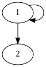
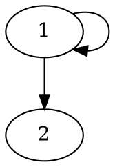
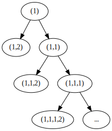
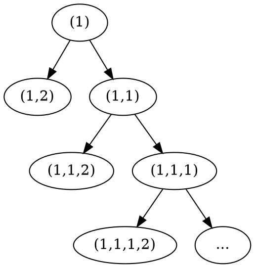
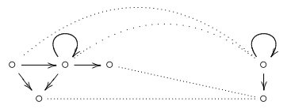

+++
title = 'Lecture 5'
template = 'page-math.html'
+++
# Lecture 5
If two states are bisimilar, then they are modally equivalent.
Prove by induction on definition of formulas.

For finitely branching models, if two states modally equivalent, then they are bisimilar.
Prove by taking modal equivalence as bisimulation.

Let Z := {(x, x') | for all φ: x ⊨ φ iff x' ⊨ φ}.
Z is a bisimulation.
- Local harmony is satisfied.
- zig: suppose (x, x') ∈ Z and x → y.
    Because x ⊨ ◇ T also x' ⊨ ◇ T.
    So x' has finitely many successors y'₁...y'n with n ≥ 1.
    Suppose for all i: y is not modally equivalent to y'ᵢ.
    There are φ₁...φn such that y ⊨ φᵢ and y'ᵢ ⊭ φᵢ.
    x ⊨ ◇(φ₁ ∧ ... ∧ φn) so also x' ⊨ ◇ (φ₁ ∧ ... ∧ φn).
    Contradiction.

Asymmetry is not modally definable.
To deal with only frames, we can use surjective bounded morphisms.

Function f : W → W' is bounded morphism from (W,R) to (W',R') if:
- for all w,v ∈ W: if Rwv then Rf(w)f(v)
- for all w ∈ W and for all v' ∈ W': if R'f(w)v' then there exists v ∈ W such that f(v) = v' and Rwv

A bounded morphism f is surjective if for every w' ∈ W' there exists w ∈ W such that f(w) = w'

If f: W → W' is surjective bounded morphism from (W,R) to (W',R'), then if (W,R) ⊨ φ then (W', R') ⊨ φ

### Bisimulation games for two players
Spoiler S claims M,s an N,t to be different.
Duplicator D claims they are similar.

Play consists of sequence of links, starting with link s ~ t.

At current link m ~ n (with m in M and n in N):
- if m an n different in their atoms, then S wins
- if not, then S picks a successor x either of m or of n
- then D has to find a matching transition to y in the other model
- play continues with next link x ~ y (or y ~ x)

If player cannot make a move, he loses.
D wins infinite games.

Modal depth of formulas.
Modal formulas are 'nearsighted':
- md(p) = md(⊥) = md(T) = 0
- md(¬φ) = md(φ)
- md(φ ∨ ψ) = md(φ ∧ ψ) = max{md(φ), md(ψ)}
- md(□ φ) = md(◇ φ) = md(φ) + 1

We need a formula of model depth k to distinguish states x and y.
Spoiler can win bisimulation game in k rounds.
Every winning strategy for Spoiler corresponds to a distinguishing formula.
Games of less than k rounds can be won by Duplicator.
Formulas of modal depth less than k cannot distinguish between x and y.

M,s and N,t satisfy the same formulas up to modal depth k iff duplicator has winning strategy in the k-round game starting in s ~ t.
If Spoiler can win in k rounds, then there is a distinguishing formula of modal depth k.

### Transforming and constructing models
#### Tree unraveling
Basically taking the states with possible paths between them, and drawing a tree.

Example:

<table>
<tr> <th>Model</th> <th>Tree unraveling</th> </tr>

<tr>
<td>

Graphviz code

<!-- :Tangle(dot) model-diagram.dot -->

</td>
<td>

Graphviz code

<!-- :Tangle(dot) tree-unraveling.dot -->

</td>
</tr>
</table>

If two trees have the same structure, they're bisimilar.

#### Model contraction
Basically getting rid of 'unnecessary' states.

### Validity and satisfiability
If φ is satisfiable, then it is satisfiable using a model with at most $2^{s(\phi)}$ elements with s(φ) the number of subformulas of φ.
