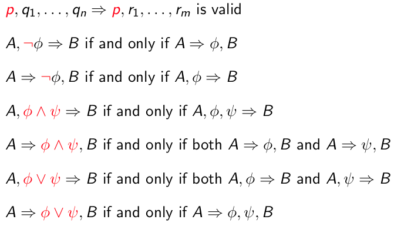
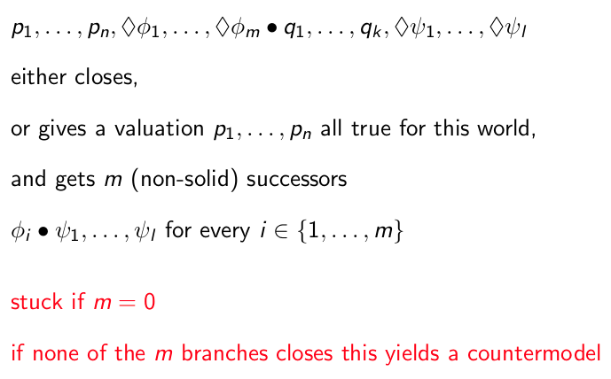
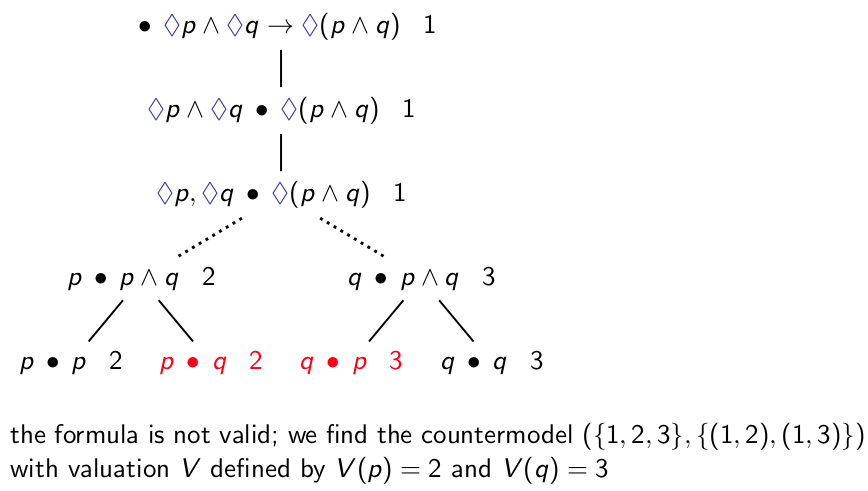

+++
title = 'Lecture 6'
+++
# Lecture 6
## Sequents
φ₁...φn ⇒ ψ₁...ψm valid if in every model, in every world in that model, the conjunction of the φᵢ implies the disjunction of the ψᵢ.

Empty conjunction is true, empty disjunction is false.

Reducing modal sequents:

φ valid iff the sequent (⇒ φ) valid.

For modal logic:
- If we get a sequent of the form p₁...n, ◇φ₁..◇φm ⇒ q₁..qk, ◇ψ₁...◇ψl
- Such a sequent only valid iff either pᵢ = qj for some i and j, or φᵢ ⇒ ψ₁...ψl is valid for some i ∈ {1...m}

Start with intended conclusion, try to build a proof while moving upwards.
Formula is valid iff it is derivable in sequent calculus.
Validity using sequents:
1. Rewrite formula
    - (a → b) to (¬ a ∨ b)
    - (¬ □ a) to (◇ ¬ a)
    - (□ a) to (¬ ◇ ¬ a)

2. Rewrite sequent, based on rules above
3. Maybe rewrite formula again
4. Decide on validity of sequent
5. Conclude on validity of formula

## Tableaux
Tableau is finite tree of sequents.
If all solid branches close, yields validity of initial sequent.
If at least one branch does not close, yields a counterexample.

The dot separates assumptions on the left from what's true on the right.
A branch closes if what's assumed also holds in the state.

In modal logic:

Example:

It's not valid because in the two red states, the letters on the left of the dot are not on the right.
The countermodel comes from taking the numbers next to each step (the numbers are states), connecting them, and creating a valuation where the letters on the left side of the dot (the assumptions) are true.
