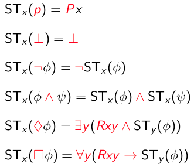
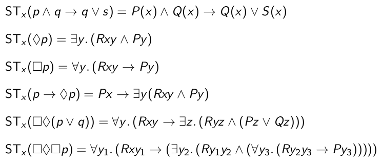

+++
title = 'Lecture 7'
+++
# Lecture 7
## Standard translation
Aim to map formulas of basic modal logic to first-order predicate logic such that:
- φ in BML is *valid* iff its translation in first-order predicate logic is *valid*
- φ in BML is *satisfiable* iff its translation in first-order predicate logic is *satisfiable*

Translation:
- translate "p is true in world x" as "predicate P holds for x"
- translate "accessibility relation R" as "binary predicate R"
- translation is relative to some state
- notation: Px instead of P(x), Rxy instead of R(x,y)

Rules for standard translation:

Examples of translation:

first-order predicate logic is decidable _if it uses at most 2 variables_.
therefore, adapt standard translation to only use 2 variables.

In a formula, check the situation with bound variables, and rename where possible.
When you are in state _a_ and start a quantification, use the variable _b_, and vice versa.

## Finite model property
If φ is satisfiable, then φ is satisfiable on a finite model.

Effective finite model property: if φ is satisfiable, then φ is satisfiable in a model of size ≤ f(φ)

Via selection:
- suppose there is a model that makes φ true
- unravel the model at x to a tree model
- φ has finite modal depth n, so restrict tree model to height n
- rewrite φ to a conjunction of first-order propositional logic formulas and diamonds
- take for every diamond formula a successor

Via filtration:
- suppose there is a model that makes φ true
- consider set S of all subformulas of φ
- define equivalence relation on S: u ~ v iff u and v are modally equivalent
    - i.e., if they agree on letters/formulas
- define W' to consist of equivalence classes [u] of states from W
- define V' using u ∈ V(p) iff [u] ∈ V'(p) for every p in S
- define a R' using R'[u][v] if Ruv, and requiring:
    - if R'[u][v] and ◇ ψ ∈ S and [v] ⊨ ψ, then [u] ⊨ ◇ φ
    - then (W', R'), V' is finite and (W', R'), V', [x] ⊨ φ

