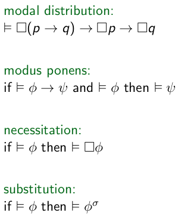
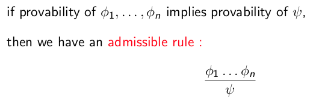

+++
title = 'Lecture 8'
+++
# Lecture 8
## Modal tautologies



## Proof systems
Hilbert systems:
- proof is sequence of numbered formulas
- every formula is: an axiom, or result of applying a derivation rule

Sufficient to have 2 axioms and a rule:
- K: φ → ψ → φ
- S: (φ → ψ → θ) → (φ → ψ) → (φ → θ)
- modus ponens: if φ and (φ → ψ), then ψ

Rules will be given, don't need to be memorized.

Admissible rule:



Proof system K is sound and complete with respect to all frames, ⊢K φ iff ⊨ φ.

<!-- TODO: add this to anki -->
Need to memorize soundness and completeness results
- K sound and complete for all frames
- T sound and complete for all _reflexive_ frames
    - T: K with □ p → p
- S4 sound and complete for all _reflexive-transitive_ frames
    - S4: T with □ p → □ □ p
- S5 sound and complete for all frames with R an equivalence relation
    - S5: S4 with ¬ □ p → □ ¬ □ p

## Example of derivation
Give derivation in K of ◇ φ ∧ □ (φ → ψ) → ◇ ψ.
Same as example in book <abbr title='Modal Logic for Open Minds (Benthem)'>MLOM</abbr> page 52.

First, work backwards from the goal towards an axiom or tautology:

```
◇ φ ∧ □ (φ → ψ) → ◇ ψ ≡ □ (φ → ψ) → (◇ φ → ◇ ψ)                 [you can rewrite a conjunction as an implication]
                      ≡ □ (φ → ψ) → (¬ □ ¬ φ → ¬ □ ¬ ψ)         [rewrite diamond to ¬ □ ¬]
                      ≡ □ (φ → ψ) → (□ ¬ ψ → □ ¬ φ)             [rewrite contrapositive (¬ a → ¬ b) to (b → a)]
                      ≡ □ (φ → ψ) → □ (¬ ψ → ¬ φ)               [box distribution over implication]
                      ≡ □ (φ → ψ) → □ (φ → ψ)                   [again contrapositive]
                      ≡ (φ → ψ) → (φ → ψ)                       [because if derivable (a → b), then derivable (□ a → □ b)]
```

We arrive at a tautology.

Then you write it out in a Hilbert-style proof, starting with the tautology/axiom.
PROP means rewriting in propositional logic.

1. (φ → ψ) → (¬ ψ → ¬ φ). PROP.
2. □ (φ → ψ) → □ (¬ ψ → ¬ φ). DISTR, 1.
3. □ (p → q) → □ p → □ q. modal distribution (i.e., this is an axiom in K that we use)
4. □ (¬ ψ → ¬ φ) → □ ¬ ψ → □ ¬ φ. substitution, 3 (i.e., substitute stuff in the axiom).
5. □ (φ → ψ) → □ ¬ ψ → □ ¬ φ. PROP, 2, 4.
6. □ (φ → ψ) → ¬ ◇ ψ → ¬ ◇ φ. definition of ◇, □.
7. □ (φ → ψ) → ◇ φ → ◇ ψ. PROP, 6.
8. ◇ φ ∧ □ (φ → ψ) → ◇ ψ. PROP, 7.

<details>
<summary>Why you can rewrite a conjunction as an implication</summary>

You can safely rewrite a conjunction to an implication: (a ∧ b → c) ≡ a → (b → c).
Remember that implication is right-associative!

If you don't trust me, I didn't trust myself either so I made a truth table:

<table>
<thead>
<tr>
<th>a</th>
<th>b</th>
<th>c</th>
<th>b → c</th>
<th>a ∧ b</th>
<th>a → c</th>
<th>a ∧ b → c</th>
<th>b → (a → c)</th>
<th>a → (b → c)</th>
</tr>
</thead>
<tbody>
<tr>
<td>0</td>
<td>0</td>
<td>0</td>
<td>1</td>
<td>0</td>
<td>1</td>
<td>1</td>
<td>1</td>
<td>1</td>
</tr>

<tr>
<td>0</td>
<td>0</td>
<td>1</td>
<td>1</td>
<td>0</td>
<td>1</td>
<td>1</td>
<td>1</td>
<td>1</td>
</tr>

<tr>
<td>0</td>
<td>1</td>
<td>0</td>
<td>0</td>
<td>0</td>
<td>1</td>
<td>1</td>
<td>1</td>
<td>1</td>
</tr>

<tr>
<td>0</td>
<td>1</td>
<td>1</td>
<td>1</td>
<td>0</td>
<td>1</td>
<td>1</td>
<td>1</td>
<td>1</td>
</tr>

<tr>
<td>1</td>
<td>0</td>
<td>0</td>
<td>1</td>
<td>0</td>
<td>0</td>
<td>1</td>
<td>1</td>
<td>1</td>
</tr>

<tr>
<td>1</td>
<td>0</td>
<td>1</td>
<td>1</td>
<td>0</td>
<td>1</td>
<td>1</td>
<td>1</td>
<td>1</td>
</tr>

<tr>
<td>1</td>
<td>1</td>
<td>0</td>
<td>0</td>
<td>1</td>
<td>0</td>
<td>0</td>
<td>0</td>
<td>0</td>
</tr>

<tr>
<td>1</td>
<td>1</td>
<td>1</td>
<td>1</td>
<td>1</td>
<td>1</td>
<td>1</td>
<td>1</td>
<td>1</td>
</tr>
</tbody>
</table>

You see that the right three columns all have the same values, so semantically the formulas are the same.

</details>

