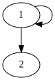
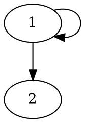
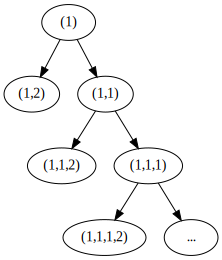
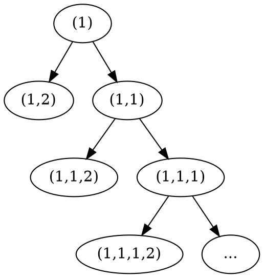
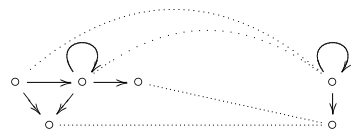

+++
title = 'Model transformations (tree unravelling, bisimulation contraction)'
template = 'page-math.html'
+++
# Lecture 5
## Transforming and constructing models
Disjoint union of models: combine models by union of states, relations, and valuations.
A state in one of the models is modally equivalent with the state in the union.

Generated submodel: starting from state w, only take its future.

### Transforming and constructing models
#### Tree unraveling
Tree unravelling: unravelling of world s in (W,R,V) is:
- $W' : (s_{1} \dots s_{n})$ with $s_{1} = s$ and $Rs_{i} s_{i+1}$
- $R'$ relates ($s_{1} \dots s_{n}$) to ($s_{1} \dots s_{n+1}$) if $Rs_{n} s_{n+1}$
- $V'(p) = \{ (s_{1} \dots s_{n} | s_{n} \in V(p) \}$
- a state in (W',R',V') is bisimilar to $s_{n}$ in (W,R,V)
- if φ is satisfiable in M,w it is satisfiable in tree unravelling of s in M

Basically taking the states with possible paths between them, and drawing a tree.

Example:

<table>
<tr> <th>Model</th> <th>Tree unraveling</th> </tr>

<tr>
<td>

Graphviz code

<!-- :Tangle(dot) model-diagram.dot -->

</td>
<td>

Graphviz code

<!-- :Tangle(dot) tree-unraveling.dot -->

</td>
</tr>
</table>

If two trees have the same structure, they're bisimilar.

#### Model contraction
Bisimulation contraction
- W' consists of equivalence classes |s| = { t such that $s \underline{\leftrightarrow} t$ }
- R' relates |s| to |t| if Ruv for some u ∈ |s| and some v ∈ |t|
- V'(p) = { |s| | s ∈ V(p) }

Basically getting rid of 'unnecessary' states.

### Validity and satisfiability
If φ is satisfiable, then it is satisfiable using a model with at most $2^{s(\phi)}$ elements with s(φ) the number of subformulas of φ.
