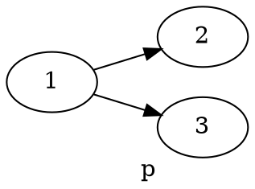
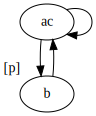
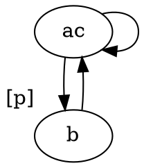
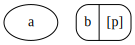
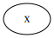

+++
title = 'Some midterm solutions'
+++
# Some midterm solutions
## Universal validity
Is this formula universally valid: ◇ (p → q) → (◇ p → ◇ q)
- Take arbitrary frame F = (W,R) and arbitrary valuation V for F.
- Take arbitrary state x ∈ W
- ? F,V,x ⊨ φ
- Assume x ⊨ ◇ (p → q). That is: there is a state y ∈ W such that Rxy and y ⊨ p → q
- Want to show x ⊨ ◇ p → ◇ q
- Assume x ⊨ ◇ p. That is: there is a state z ∈ W such that Rxz and z ⊨ p.
- Note: y and z are not necessarily the same! (but they might be)
- Counter-model:

    

    - 3 ⊨ p so 1 ⊨ ◇ p
    - 2 ⊨ ¬ p so 2 ⊨ p → q so 1 ⊨ ◇ (p → q)
    - 2 ⊭ q, 3 ⊭ q so 1 ⊭ ◇ q
- By counter-model, the formula is not universally valid

<details>
<summary>Graphviz code</summary>

<!-- :Tangle(dot) counter-model.dot -->


</details>

## Formula for a statement
"Has no blind successor": ¬ ◇ □ ⊥, □ ◇ T ("wherever I go, I can do a step"), □ ¬ □ ⊥

"Has at least one non blind successor": ◇ ◇ T

## Bisimulation & contraction
That question about two models, if asked say they are bisimilar, just give a bisimulation and say the pair consisting of the two states is in the bisimulation.

The bisimulation contraction is then:



<details>
<summary>Graphviz code</summary>

<!-- :Tangle(dot) bisimulation-contraction.dot -->


</details>

## Global diamond
Asked to see if global diamond is definable in basic modal logic (BML), as given by: M,x ⊨ E φ iff there is y ∈ W such that y ⊨ φ.
(Side remark: if we can define it, the operator is like an abbreviation, it doesn't change the expressive power).

Steps:
- Suppose E is definable in BML by ζ.
- Suppose Ep is definable in BML by ζ(p).
- Consider the models:

    <table>
    <thead><th>M</th><th>N</th></thead>
    <tbody>
    <tr>
    <td>

    

    <details>
    <summary>Graphviz code</summary>

    <!-- :Tangle(dot) model-m.dot -->
    ```dot
    digraph g {
    a
    b [label="b | [p]"]
    }
    ```

    </details>
    </td>

    <td>

    

    <details>
    <summary>Graphviz code</summary>

    <!-- :Tangle(dot) model-n.dot -->
    ```dot
    digraph g {
    x
    }
    ```

    </details>
    </td>
    </tr>
    </tbody>
    </table>

- We have M,a ⊨ Ep because M,b ⊨ p, so M,a ⊨ ζ(p).
- N,x ⊭ Ep so N,x ⊭ ζ(p).
- We have M,a bisimilar with N,x because Z = {(a,x)} is a bisimulation and (a,x) ∈ Z.
- Because bisimilar states are modally equivalent, they must make true the same formulas in BML. So a ⊨ ζ(p) iff x ⊨ ζ(p).
- Contradiction: N,x ⊭ ζ(p)
- So, the assumption that E is definable in BML does not hold.
- Therefore, E is not definable in BML.


