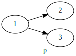
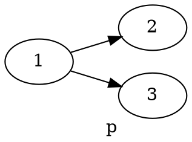

+++
title = 'Some midterm solutions'
+++
# Some midterm solutions
## Universal validity
Is this formula universally valid: ◇ (p → q) → (◇ p → ◇ q)
- Take arbitrary frame F = (W,R) and arbitrary valuation V for F.
- Take arbitrary state x ∈ W
- ? F,V,x ⊨ φ
- Assume x ⊨ ◇ (p → q). That is: there is a state y ∈ W such that Rxy and y ⊨ p → q
- Want to show x ⊨ ◇ p → ◇ q
- Assume x ⊨ ◇ p. That is: there is a state z ∈ W such that Rxz and z ⊨ p.
- Note: y and z are not necessarily the same! (but they might be)
- Counter-model:

    

    - 3 ⊨ p so 1 ⊨ ◇ p
    - 2 ⊨ ¬ p so 2 ⊨ p → q so 1 ⊨ ◇ (p → q)
    - 2 ⊭ q, 3 ⊭ q so 1 ⊭ ◇ q
- By counter-model, the formula is not universally valid

Graphviz code

<!-- :Tangle(dot) counter-model.dot -->

## Formula for a statement
"Has no blind successor": ¬ ◇ □ ⊥, □ ◇ T ("wherever I go, I can do a step"), □ ¬ □ ⊥

"Has at least one non blind successor": ◇ ◇ T
