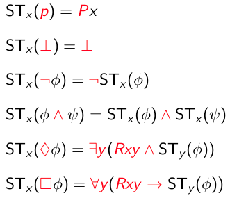
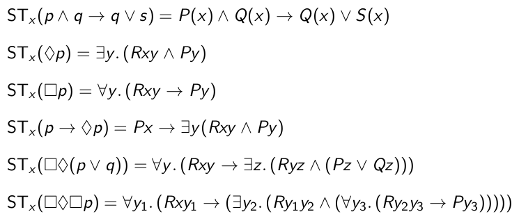

+++
title = 'Standard translation: mapping basic modal logic to first-order predicate logic'
+++
# Standard translation: mapping basic modal logic to first-order predicate logic
Aim to map formulas of basic modal logic to first-order predicate logic such that:
- φ in BML is *valid* iff its translation in first-order predicate logic is *valid*
- φ in BML is *satisfiable* iff its translation in first-order predicate logic is *satisfiable*

Translation:
- translate "p is true in world x" as "predicate P holds for x"
- translate "accessibility relation R" as "binary predicate R"
- translation is relative to some state
- notation: Px instead of P(x), Rxy instead of R(x,y)

Rules for standard translation:

Examples of translation:

first-order predicate logic is decidable _if it uses at most 2 variables_.
therefore, adapt standard translation to only use 2 variables.

In a formula, check the situation with bound variables, and rename where possible.
When you are in state _a_ and start a quantification, use the variable _b_, and vice versa.
