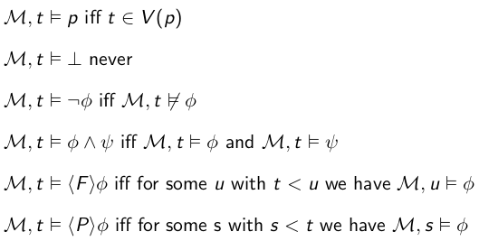
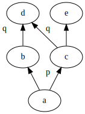
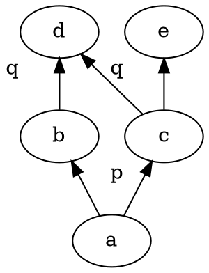
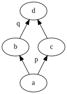
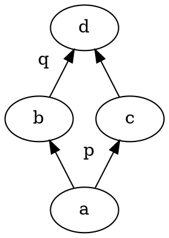

+++
title = 'Temporal logic'
+++
# Lecture 9
## Temporal logic using temporal frames
Linear time logic: events along a single computation path. 'at some point we will have p'

Branching time logic: quantify over possible paths. 'there is a path where eventually p'

A frame F = (T, <) is a temporal frame if both:
- < is irreflexive: not t < t for all t
- < is transitive: if t < u and u < v then t < v

Truth and validity:

Right-linearity:
- "all future points are related"
- definition: ∀ x,y,z: (x < y) ∧ (x < z) → (y < z) ∨ (y = z) ∨ (z < y)
- is modally definable

Right-branching:
- "right-branching is _not_ right-linear, so some point has two unrelated points in the future"
- definition: there exist x,y,z such that x < y and x < z but ¬ (y < z) ∧ y ≠ z ∧ ¬ (z < y)
- is _not_ modally definable

Discrete:
- "every point with a successor has an immediate successor
- definition: (x < y ) → ∃ z : x < z ∧ ¬ ∃ u: ( x < u) ∧ (u < z)
- is modally definable in basic temporal logic

Dense:
- "between any two points is a third one"
- definition: x < z → ∃ y (x < y ∧ y < z)
- is modally definable

Operator next:
- symbol ⊗
- M,t ⊨ ⊗ φ iff ∃ v : t < v ∧ (¬ ∃ u : t < u < v) ∧ M,v ⊨ φ
    - e.g. x ⊨ ⊗p: there a future we can reach only in 1 step from x where p holds
    - you can go directly from centraal to Utrecht, but Amstelstation is still there
- next not definable in basic modal logic

Operator until:
- symbol U
- M,t ⊨ φ U ψ iff ∃ v : t < v ∧ M,v ⊨ ψ ∧ ∀ u : t < u < v → M,u ⊨ φ
    - if we have a future where ψ holds, then φ holds in all points between now and that future
- not definable in basic modal logic

Examples of until:

<table>
<tr>
<td>

Graphviz code

<!-- :Tangle(dot) until-1.dot -->

</td>
<td>

Graphviz code

<!-- :Tangle(dot) until-2.dot -->

</td>
</tr>

<tr>
<td>
a ⊨ p U q. e.g. state e, we have q, and in any paths we have to go through states that have p.
</td>

<td>
a ⊭ p U q. because we do not have p in state b.
</td>
</tr>
</table>

In a temporal frame:
- ◇ p is equivalent to T U p
- ⊗ p i equivalent to ⊥ U p

<!--
TODO: Things to look at:
- until not definable in basic modal logic in temporal frames
- until not definable in temporal modal logic in temporal frames
- next not definable in basic modal logic in temporal frames
- define discrete in temporal logic
- use next to define discrete in temporal logic
- define right-linearity in temporal logic
-->
