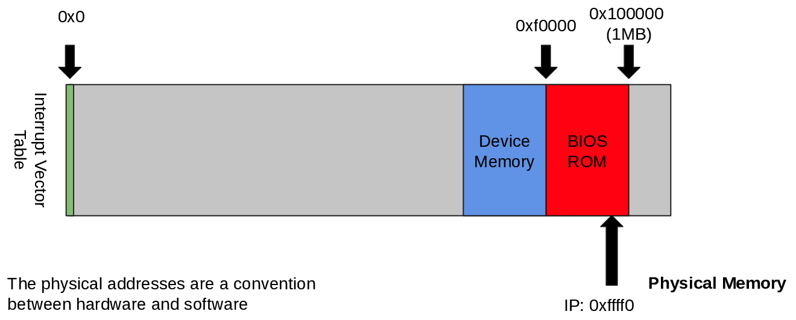
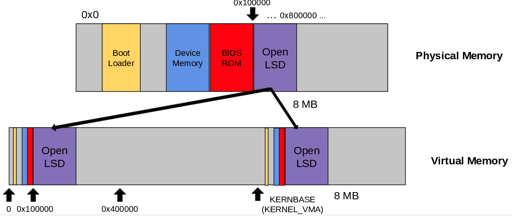

+++
title = 'Booting x86_64'
+++
# Booting x86\_64
When you power on:
1. CPU executes code from ROM
2. Loads platform firmware (BIOS, UEFI, Coreboot..)
3. Initializes memory and other devices
4. Loads boot code into memory
5. Executes boot code

Memory layout before boot:

Two-stage bootloader:
- BIOS only loads first disk sector, which is at least 512 bytes
- first stage loads the second stage

Memory map -- not all memory available yet
- int 0x5; eax = 0xe820
- bootloader sets this up, so `kmain(struct boot_info *)` already has the necessary info

Loading the kernel
- OpenLSD uses ELF format
- kernel follows the bootloader
- after setting up protected mode, boot loader reads kernel into memory and jumps to kernel entry function

Mapping virtual to physical addresses
- translation virtual → physical done by CPU (MMU) via page tables

