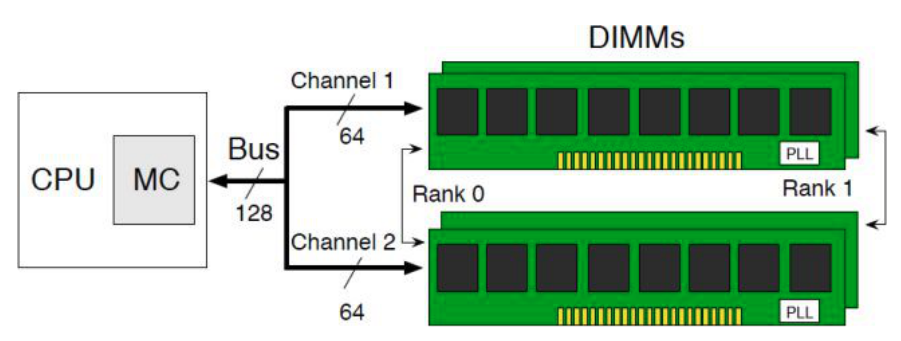
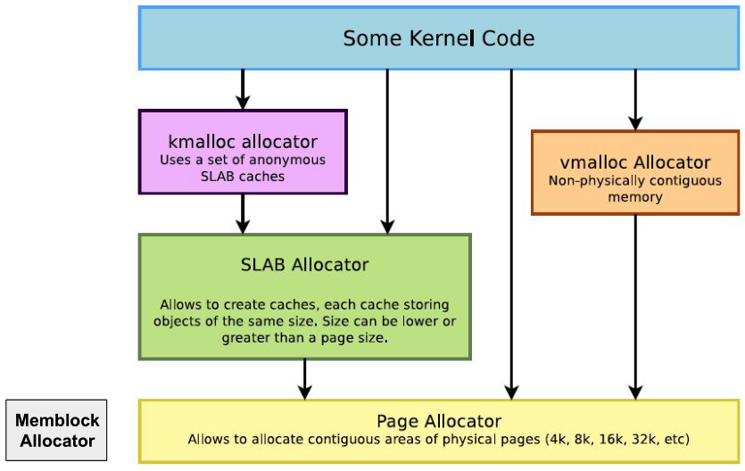
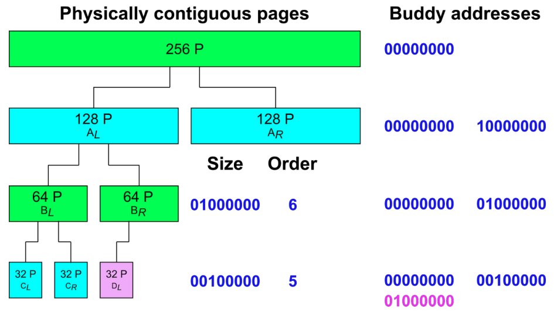
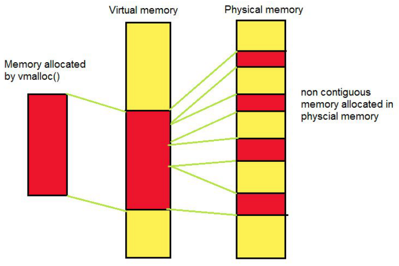
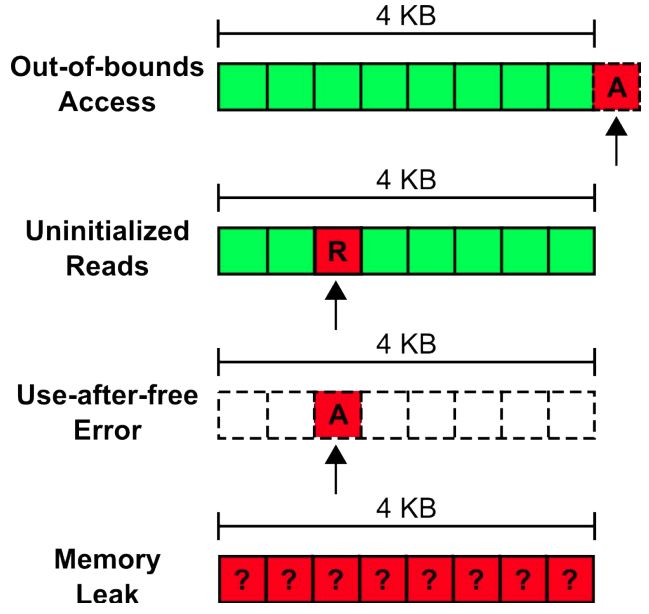

+++
title = 'Managing physical memory'
+++

# Managing physical memory

## Basic data structures
Physical memory -- DRAM (Dynamic random access memory)
- memory cells with 1-bit data
- each cell has 1 capacitor + 1 transistor
- charge/discharge capacitor == 1/0 bit value
- capacitors leak charge → need periodic refresh (difference with SRAM)
- organized in: channels, DIMMs, ranks, chips, banks, rows/

- NUMA: each CPU package has own memory, can access memory of others with some latency

Managing physical memory on Linux
- logically divided in number of consecutive physical memory pages (page frames)
- identified by page frame numbers (PFNs)
- frames organized in
 - nodes - "banks"
 - zones - tagged regions for each node
   - when under memory pressure, zone boundaries become "blurry"
   - watermarking strategy to free pages (kswapd): WMARK\_MIN (trigger direct reclaim), WMARK\_LOW (trigger async reclaim), WMARK\_HIGH (stop reclaiming)
 - pages - physical page frames per zone
   - 4KB units of physical memory

## Allocating memory

### Memblock allocator
- early boot-time (low mem) allocator
- replaces old bootmem allocator
- mostly used to initialize buddy allocator, discarded after initialization
- consists of two arrays:
  - memory: all present memory in system
  - reserved: allocated memory ranges
- allocates by finding regions in `memory && !reserved`

Implementation:
- setup:
  - add all available physical memory regions to memory
  - add reserved ones to reserved
  - all regions sorted by base address
- allocation:
  - first-fit `memory && !reserved`
  - just add the range to reserved
  - merge neighboring regions as necessary
- deallocation:
  - linear scan in reserved for containing region
  - remove the range from reserved
  - split region if necessary

### Buddy/zone allocator

- "power-of-two allocator with free coalescing"
- blocks arranged in 2ᴺ (N=order) pages
- allocations satisfied by exact N
  - if not possible, split larger 2ᴺ⁺¹ block to 2×2ᴺ
  - two smaller blocks are 'buddies'
  - if not possible, split larger 2ᴺ⁺² block twice, etc
- deallocations return block to allocator
  - if buddy free, coalesce into larger block
  - if larger block's buddy free, coalesce again, etc.

Implementation:
- for each node and zone, array of MAX\_ORDER freelists
  - freelist N maintains free blocks size 2ᴺ
  - split/merge moves block(s) to previous/next freelist
  - PG_buddy, order in page attributes (set if free)
  - buddy operations: reserve (update page flags), lookup (flip 'order' bit in block address)

#### Fragmentation
External fragmentation:
- can't allocate because of too many small free blocks
- addressed via
  - free coalescing
  - vmalloc allocator for large allocations
	- first-fit, similar to memblock
	- to allocate size N: allocate N page frames, map page frames in virtually continuous buffer

	

Internal fragmentation
- wasted because because large block assigned to smaller allocation(s)
- addressed via slab allocators
  - for small allocations
  - many implementations
  - memory allocated from per-object-size caches (typical range 8 B to 8 KB)
  - allocated memory physically contiguous

## Memory errors in frame allocation

Sanity checks done by Linux (`CONFIG_DEBUG_PAGEALLOC` macro):
- out-of-bounds detection
  - with page guarding: function `page_is_guard`, bracket allocated page with guard pages. but can only detect out-of-bounds access in those limits. used by Linux
  - alternative, page canaries: stick a special value on each side of the allocated page
- use-after-free detection
  - page remapping: (function `kernel_map_pages`, when the allocator frees the object, unmap corresponding page frames from virtual memory)
  - alternative, page poisoning: function `kernel_poison_pages`, poison the page with some value when deallocated
- `check_new_page`: semantic checks on page descriptor
- `free_pages`: invalid free detection

Object-level sanitizers: kmemcheck (uninitialized reads), kmemleak (memory leaks), kasan (out-of-bounds and use-after-free)
