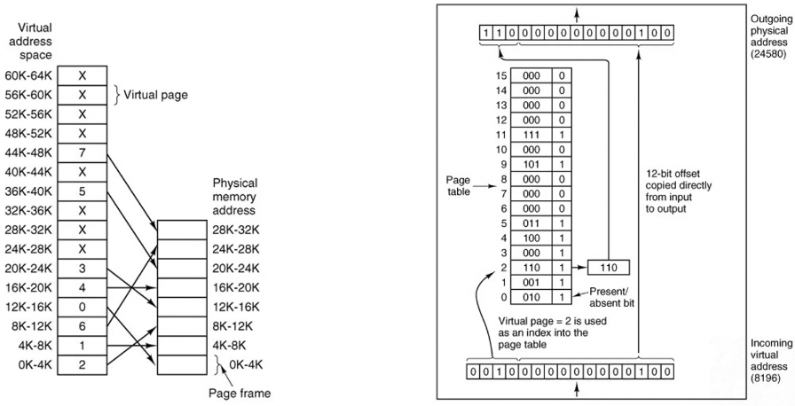
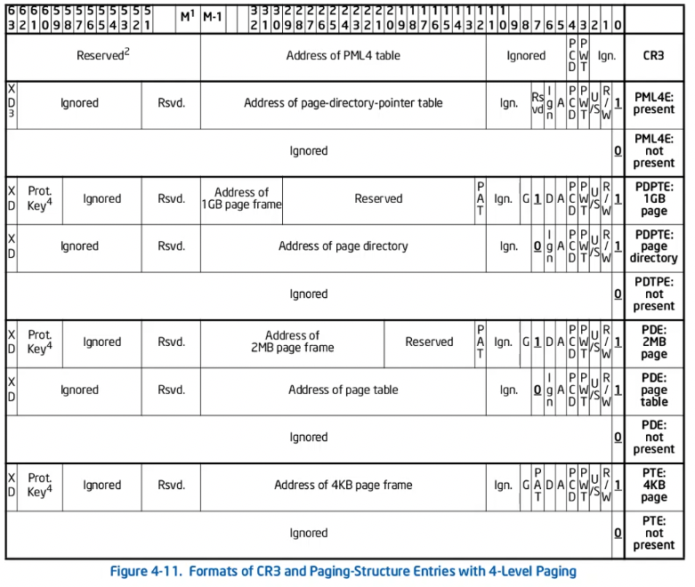
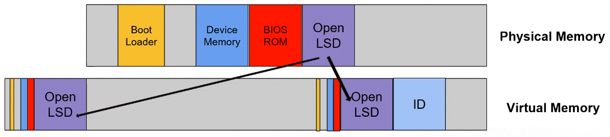

+++
title = 'Page tables'
+++
# Page tables
## Memory access
What happens on pointer dereference? It depends.
Address in virtual memory may not be the same as in RAM.

Virtual memory:
- OS tells CPU how to map virtual memory addresses to physical memory addresses
- OS creates page table: storing physical addresses, indexed with virtual addresses
- physical address of page table are in special register (car3)
- on memory access, CPU looks up virtual address to find physical address

### Address spaces
- OS can create multiple page tables
  - each defining different virt → phys mapping
  - only one active at a time, selected by cr3
- each page table defines address space

Why address spaces?
- virtualize physical memory
- flexible memory management
- isolation and protection

### Page tables
address translated at page granularity
- page: chunk of memory
- architecture defines possible page size(s), typically 4 KB

Memory Management Unit (MMU) performs translation

#### Basic linear page-table
Let's say we dereference virtual address `0010000000000100`.
1. The first 4 bits are index into page table. `0010` is 2 in decimal, so page at index 2 in page table is used.
2. Index 2 contains the value `1101`, where the last bit is the 'present/absent' bit (i.e. does the entry map to a physical address). The first 3 bits are used as the first 3 bits in the outgoing physical address.
3. The resultant physical address is `110000000000100`: the 3 bits from the page table entry, and the 12 bits copied from the virtual address.



#### Hierarchical page tables (x86_32)
Use a top-level page table that points to other page tables.

The first 10 bits are an index into top-level page table, the second 10 bits index into second-level page table, and the last 12 bits are the offset.

The downside is, you need more lookups.

#### Inverted page tables (IA64)
Make a page table tailored to the size of physical memory instead of virtual.
Then, use a hash table, indexed by hash on virtual page, with list of pages.

#### Four-level page tables (x86_64)
Only implements lowest 48 bits of the address, the rest are sign extend.

Register cr3 is pointer to a highest-level page table (PML4E).
First 9 bits are index into table, which points to page-directory-pointer table (PDPE).
The next 9 bits to page-directory table, then the page table, then a physical page, with the last 12 bits being the offset.



## Page table management
### Static page tables for bootstrapping
OpenLSD maps two locations in virtual memory:
- identity, i.e. address is same as in virtual and physical
- KERNBASE (where kernel is loaded)
  - programs are loaded at lower address after

In AT&T syntax (src, dst):

```asm
movl $(PAGE_PRESENT | PAGE_WRITE | PAGE_HUGE), %eax ; mapping 2 MiB pages
movl $page_dir, %edi
movl $4, %ecx           ; we want 4 entries

.map_pages:             ; identity mapping
movl %eax, (%edi)
addl $0x200000, %eax    ; map next physical address
addl $8, %edi
dec %ecx                ; decrement counter
jnz .map_pages

;; at next higher level, load single entry with identity mapping
movl $page_dir, %eax
orl $(PAGE_PRESENT | PAGE_WRITE), %eax
movl %eax, pdpt

;; and higher level again
movl $pdpt, %eax
orl $(PAGE_PRESENT | PAGE_WRITE), %eax
movl %eax, pml4
movl %eax, pml4 + 256*8

;; Load the root into cr3
movl $pml4, %eax
movl %eax, %cr3
```



### Dynamic page table management (post boot)
Two issues:
- what should your virtual address spaces look like (policies)
- how would you do these things (mechanisms)

Policies:
- Supervisor bit: allow or disallow kernel access
- Present bit: 1 if the page is mapped (but should also clear page frame address on unmap).
- page table address bits: point to physical address (need to flush CPU buffers containing recent data to avoid RIDL)

Mechanisms:
- dynamically update page tables per address space
- MMU uses updated page tables to find physical pages for virtual pages

page table walk on x86_64 with 4-level page table, 48 bit virtual address, page tables mapped in virt memory:

  1. locate top-level page table: read cr3 register (or process struct)
  2. locate 2nd-level page table
     - get virtual pointer to top-level page
     - use bits 39-47 of virtual address as index
     - if not page table entry present, abort.
  3. locate 3rd-level page table
     - get virtual pointer to 2nd-level page
     - use bits 30-38 of virtual address as index
     - if not page table entry present, abort.
  4. ...
  5. last page table entry has physical address of page

page table mapping:
- locate page table entry for virtual address to be mapped, using page walk
- if not present: allocate new page, store physical address in non-present entry, continue with next level
- store physical address to be mapped in final page table entry & mark as present

page table unmapping
- locate page table entry for virtual address to be unmapped, using page walk
- zero out final page table entry
- free pages

permission bits:
- P: present (1) or not (0)
- R/W: read-only (0) or writable (1)
- U/S: supervisor-only (0, i.e. kernel) or user-accessible (1)
  - SMAP protection: 1 becomes user-only
- XD: execute allowed (0) or disabled (1)

## Optimizations
### TLB (caching)
result of page table translation: virtual address x is at physical address y

approach for memory access:
- look up x in TLB
- on hit, no need to consult page table
- on miss, page table walk and then cache in TLB

Needs to be super fast, so small number of sets.

Flush TLB:
- when switching to new address space
- when deleting/updating page table entries

TLB scalability:
- translation caches:
  - TLB tagged with all bits of virtual address
  - translation caches tagged with part of virtual address
  - managed transparently by hardware
- use bigger pages


## Security
- leave holes in identity map (i.e. guard pages)
  - no wastage, but more complex management
- kernel exploitation:
  - find known locations in kernel space: physmap (mapping of physical address space), kernel base address
  - trigger vulnerability and corrupt data in known locations, or diverge control flow

kernel address space layout randomization (KASLR):
- randomizes sections of kernel address space
  - harder to exploit the kernel. but still, bruteforce (though crashes), or leak kernel pointers (need second vulnerability), or side-channel attacks (but complicated)
- implementation:
  - limit entropy to simplify memory management
  - remain same until reboot
  - random slot chosen early in boot, kernel mapped there
  - random mapping translates to different slots in page table pages
