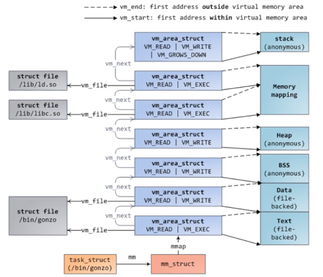

+++
title = 'Paging'
+++

# Paging
## Page faults
Special kind of exception, IV 14.

Types:
- invalid: access to invalid address (e.g. write to RO page)
- major (slower): valid, but page not in memory (e.g. file, swapped pages)
- minor (faster): valid, page in memory

Kernel page fault:
- invalid:
    - on kernel address: oops (panic/recovery)
    - on user address: checks (copy to/from user)
- major: kernel memory is paged out (not on Linux, e.g. in Windows)
- minor: lazy allocations (e.g. old vmalloc)

User page fault:
- could be anything

Page fault information:
- cr2 register has faulting virtual address
- error code on stack has:
    - bunch of reserved bits
    - P: PTE present bit set (so page present, maybe fault caused by some other problem)
    - W: write access
    - U: user access (so we were in user eecution)
    - R: PTE had reserved bits set
    - I: faulted while trying to fetch instruction

VMA:
- contiguous virtual region with given properties (bit flags)
- anonymous: no file
- stored in red-black tree (for efficiency) and linked list (for traversing in order)

Demand paging:
- new pages are not mapped onto physical memory
- on first access, process page faults
- kernel assigns page frame to process, creates PTE, resumes execution

VMA operations:
- mmap: maps new region in adress space
    - find fitting hole in memory map, creates and links new VMA (in simplest case)
- munmap: unmaps region in address space
    - unlinks and deletes VMA (in simplest case), removes mapped page frames, removes allocated page tables, flushes TLB
- mprotect: changes region's protection bits
    - update VMA protection (in simplest case), update affected PTEs
- madvise: give kernel advice on region, like `MADV_DONTNEED` (unmap page frames), `MADV_WILLNEED` (read ahead page frames)
- find and split: when you work on a part of a VMA (might even split one into three parts)
- merge: merge any adjacent VMAs with same properties (flags)

Transparent Huge Pages (THP)
- kernel transparently allocates THP when possible
- map: allocate compound pages (physically contiguous pages) and map as THPs
- collapse: replace some regular pages with THP
- split: split THP into number of regular pages
- compact: memory compaction to allocate compound pages
