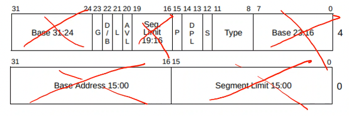

+++
title = 'User mode'
+++
# User mode
## Privilege separation
Operating system's task:
- safe and efficient multiplexing of system resources to competing apps
- CPU provides management and safety via privileged instructions
- OS uses this to manage user apps

Privilege separation on x86:
- 4 rings: 0 (kernel), 1, 2, 3 (user processes)
- segmentation:
    - memory divided into several segments
    - each pointer deref has segment associated with it:
        - coe pointer: CS (code segment)
        - heap pointer: data segment (DS)
        - local variable pointer: stack segment (SS)
    - x86_64 pretends not to have segments -- all segments point to same memory, more or less
        - but, low-order 2 bits of CS register determine current ring
- switching x86 rings
    - no instruction to set CS irectly
    - traditional way is using interrupts:
        - user → kernel
            - interrupt CPU (`int` instruction)
            - CPU switches to interrupt handler in kernel
        - kernel → user
            - kernel interrupt handler returns (`iret` instruction)
            - CPU restores user mode state, including CS
- Global Descriptor Table
    - defines segments, among other things
    - code segment is an offset into GDT, so is data segment
    - GDTR register points to GDT
    - 64-bit GDT entries (crossed out parts are legacy):
        - DPL: descriptor privilege level. Which rings can access the segment.

    

- Address spaces and user processes:
    - different page tables create different address spaces
    - address spaces isolate processes from each other
    - most modern OSes provide a one-to-one mapping between address spaces and user processes

## Security
Meltdown (rogue data cache load):
- bypasses supervisor bit
- when CPU tries to read data that it can't read, it will fault
- modern CPUs speculate on what might happen after an operation
- CPU speculates on the read, generates fault only later, so the data will be in the cache
- you end up with arbitrary kernel reads from user mode
- Kernel page table isolation:
    - kernel just isn't mapped into app address space, except for a small area for interrupt handlers
    - kernel has its own address space
    - but it impacts performance: switch page tables, flush TLB, etc.

Foreshadow (L1TF)
- bypasses present bit
- should also set address to 0 when unmapping a page

MDS (RIDL):
- bypasses address bits
- flush CPU buffers before iretq

Defending kernel attacks:
- SMEP: supervisor mode execution protection
- SMAP: supervisor mode access protection
- ASLR: address space layout randomization
    - map user mode code and data in random locations in virtual address space

## Interrupts
- events "interrupting" execution flow
- kernel handles interrupt before program execution continues
- external: key presses, network packets
    - device signals CPU by setting a pin using an electrical signal
    - most hardware interrupts can be masked (disabled), using IF in EFLAGS register
- internal: divide by zero, page fault, system call

Most software interrupts are synchronous: directly before/after instruction

Most hardware interrupts are asynchronous: can come at any time, proper masking is important

During an interrupt:
1. CPU elevates privilege level and switches to kernel stack
2. Some user context (e.g. `rip`) is saved
3. function is called to handle interrupt ("interrupt service routine")
    - on x86, interrupt descriptor table (IDT) shows how to handle various interrupts
    - IDTR register points to IDT (set with `lidt` instruction)
    - IDT has max 256 entries (1 byte int)
    - first 32 entries are exceptions
    - 16 external interrupts can be remapped using APIC unit
    - calling interrupt handler:
        - interrupt vector used as inex into IDT, which has interrupt gates
            - type of gate can be interrupt or trap
            - interrupt gate clears IF in EFLAGS to mask further interrupts
        - jump to interrupt handler: set CS to segment selector (changing ring), set RIP to offset (jumps to interrupt handler)
        - switch stack:
            - kernel stack pointer stored in Task State Segment (TSS)
            - task register (TR) contains index in the GDT that specifies where TSS is (can set with `ltr` instruction)
            - glue pieces of base address together to find address of TSS
            - TSS contains stack pointers for each ring
            - load RSP0 from TSS into RSP
            - set stack segment to null
        - store calling context
            - old register values stored on kernel stack, to be restored later
    - returning from interrupts
        - `iret` returns back to location at time of interrupts
        - pops right amount from stack, restores stack, returns to last `rip`, drops privilege
4. CPU restores some of user context and drops privilege level

Dealing with livelocks (when the CPU is doing work, but not useful work):
- do as little as you can in interrupt handler, schedule work for later
- reduce number of interrupts: use hardware demuxing, poll instead of large number of interrupts

## System calls
Kernel support for servicing user apps.

Originally only issues using `int` instruction.
Kernel-user communication dictated by calling convention.

Each OS specifies its own calling convention.
- X86 Linux:
    - `int 0x80` to issue system call
    - `%rax` has syscall number
    - arguments specified in `%rdi`, `%rsi`, `%rdx`, `%r10`, `%r8`, and `%r9`
    - kernel places return value in `%rax`

`syscall`
- caching IDT entry for system call in special CPU register
- `syscall`/`sysret` and dedicated registers
- requires setup through MSR (model-specific registers) via `rdmsr`/`wrmsr`
- on `syscall`:
    - saves RFLAGS in `%r11`, masks RFLAGS
    - saves `%rip` in `%rcx` (and switches `%rip` to handler)
    - switches CS, SS, and privilege level to ring 0
- on `sysret`:
    - restores RFLAGS from `%r11`
    - restores `%rip` from `%rcx`
    - switches CS, SS, privilege level to ring 3

VDSO:
- in 32-bit x86, fast syscall instruction (`sysenter`) was optional in CPU
- need to retain legacy `int` support
- so kernel figures out what CPU supports using `cpuid` instruciton
- VDSO: virtual syscall page with optimal system call instruction
    - replaces `int 0x80` with a `call <addr>`
    - allows for fixed return point
    - looks like a dynamic shared object
