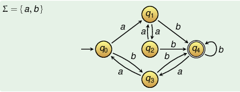

+++
title = "Lecture 1"
template = "page-math.html"
+++

# Automata and complexity

[Slides](http://joerg.endrullis.de/automata/)

## Intro

Some problems are undecidable: program termination, post correspondence
problem

Some are NP-complete - travelling salesman, satisfiability in
prop. logic

**Word**: finite sequence of symbols from finite alphabet Σ

conventions:

-   symbols: a, b, c
-   words: u, v, w, x, y, z
-   empty word: λ

computer program is a word, takes input word, produces output word

can concatenate words, \|v\| means length of word

power vk is k concatenations of v's

reverse (a1 ... an)R = an ... a1

## Formal languages

Formal language: set of words.

Σ\* is set of all words over Σ, formal language L is subset of Σ\*

Since it's a set, the usual set operations have meaning (complement,
union, intersection, etc.)

nth power of language is Ln+1 = Ln L

Kleene star: $L* = \bigcup_{i=0}{\infty} Li$, $L+ = \bigcup_{i=1}{\infty} Li$

$\overline{L}R$ == $\overline{LR}$

But sets are not the best for language description, so let's use something else.

## Deterministic Finite Automata (DFA)

Consists of:

-   Q: finite set of states
-   Σ: finite input alphabet
-   δ : Q × Σ → Q: transition function
-   q0 ∈ Q: starting state
-   set F ⊂ Q of final states

If automaton in state q reads symbol a, resulting state is δ(q, a).

$(q, aw) \vdash (q', w) \quad if \quad \delta(q, a) = q'$

You can write transition function δ in form of table:

|       | State              ||
| ---   | ------   | ------   |
| **δ** | **q0** | **q1** |
| a     | q0     | q1     |
| b     | q1     | q0     |

### DFA transition graphs

DFA can be visualised as transition graph:

-   states are nodes of graph
-   arows with labels from Σ
-   starting state: extra incoming arrow
-   final states: double circle
-   arrow q → q\' with label a iff δ(q, a) = q\'

if $(q, w) \vdash^* (q', λ)$, can write $q \xrightarrow{w} q'$

A DFA defines a regular language based on what it accepts (or rejects).

To get a complement, you can just invert final states.

### Determinism

Deterministic: for every state and symbol, any state q has only one
outgoing arrow with label a

For every input word, there\'s exactly one path from starting state
through transition graph

### Theorems for regular languages

A language is regular if there is a DFA M = (Q, Σ, δ, q0, F) with L(M) = L

If L regular, $\overline{L}$ also regular.

If L1 and L2 regular, then L1 ∪ L2 regular.

If L regular, LR regular.

Every finite language is regular.
