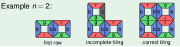
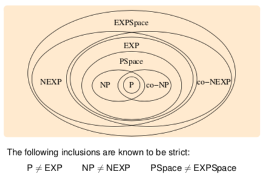

+++
title = "Lecture 11"
template = "page-math.html"
+++

# Time complexity contd.
## Bounded tiling problem
Input is natural number n, finite collection of types of tiles, the first row of n tiles
is it possible to tile an n × n field with the given first row?
when connecting tiles, the touching side must have the same color, tiles must not be rotated.

the problem is NP-complete

## co-NP
Problem L is in co-NP if complement $\bar{L}$ is in NP.
i.e. set of instances without solution is in NP.

we don't know if NP = co-NP in general.
but if an NP-complete problem is in co-NP, then NP = co-NP.

## EXP and NEXP
Nondeterministic TM is exponential time if it runs in time $2^{p(|x|)}$ for some polynomial p.

NEXP is nondeterministic exponential, EXP is deterministic exponential.

P ⊆ NP ⊆ PSpace ⊆ EXP ⊆ NEXP. we don't know if this is strict. we know that P ≠ EXP, NP ≠ NEXP.

# Space complexity
Nondeterministic Turing machine M runs in space f if for every input w, every computation of the machine visits at most f(|w|) positions on the tape.
i.e. the function f is the upper bound on number of visited cells on tape (length of input word)

## PSpace and NPSpace
Nondeterministic Turing machine is in polynomial space if it runs in space p for some polynomial p.

NPSpace is if it runs in nondeterministic polynomial space, PSpace if deterministic.

Savitch's theorem: if language accepted by nondeterministic TM in f(n) space, then accepted by deterministic TM in f(n)² space.
PSpace = NPSpace.

A language L ∈ PSpace is PSPace-complete if every language L' ∈ PSpace is polynomial-time reducible to L.

# Complexity hierarchy

