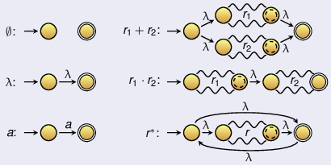
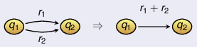
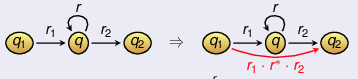
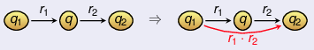
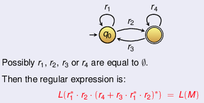

+++
title = "Lecture 3"
template = "page-math.html"
+++

## Grammars (contd)

### Right linear grammars (contd)

1.  Strict right linear grammars

    Let G be right linear grammar G = (V, T, S, P) There is a strictly
    right linear grammar H such that L(G) = L(H):

    1.  Assume we have production rule γ of form A → u(B) with A,B ∈ V
        and u ∈ T\* with \|u\| \> 1. Then u = aw for some a ∈ T and w
        ∈ T\^+.
    2.  Let X be a fresh variable, add X to V and split rule γ into:
        -   A → aX
        -   X → w(B)

        Then A → aX → aw(B) = u(B). So L(G) = L(H).
    3.  Repeat splitting until \|u\|  ≤ 1 for all rules.

2.  Prove right linear grammars ⇔ regular languages

    Thm: language L is regular ⇔ there is right linear grammar G with
    L(G) = L

    Proof ⇒:

    -   translate NFA/DFAs into right linear grammars: use states as
        nonterminals and transitions as rules

    Proof ⇐:

    -   build NFA from right linear grammar

### Left linear grammars

Left linear: all production rules only have non-terminals on left side

Thm: language L is regular iff there is left linear grammar G with L(G) = L.

Proof: L regular ⇔ LR is regular ⇔ right linear grammar for LR ⇔
left linear grammar for L (reverse all production rules)

Mixing right and left linear rules doesn't mean that the generated
language will be regular!

## Regular expressions

Definition of regex over alphabet Σ:

-   ∅, λ are regular expressions
-   a is regular expression for ever a ∈ Σ
-   r1 + r2 is regular expression for all regexes r1 and r2
-   $r_1 \cdot r_2$ is regex for all regexes r1 and r2
-   r* is regex for all regexes r

### Regex to NFA

For every regex r, build NFA such that:

-   L(M) = L(r)
-   M has precisely one final state (different from the starting state)

### NFA to regex

1.  Transform M st there is only one final state. If M has multiple
    final states:

    -   add fresh state qf to M
    -   for every final state q in M, add arrow $q \xrightarrow{\lambda} q_f$ to M
    -   define qf as only final state

2.  Remove all double arrows. Use transition graphs with regexes as
    labels. If there are e2 arrows from state q1 to q2 with labels
    r1 and r2, replace them by one arrow with label r1 + r2. It
    might be that q1 == q2, then arrows are loops.

    

3.  As long as there are states other than starting and final state:

    -   remove one state q

    -   for all states q1,q2 and arrows $q_1 \xrightarrow{r_1} q$ and $q \xrightarrow{r_2} q_2$,
        add arrow from q1 to q2 as follows:

        -   if arrow $q \xrightarrow{r} q$:

            

        -   otherwise:

            

4.  If F  ≠ *q*0, then transition graph is reduced:

    

## Alternative descriptions of regular languages

These statements mean the same thing:

-   there is DFA M with L(M) = L
-   there is NFA M with L(M) = L
-   there is right linear grammar G with L(G) = L
-   there is left linear grammar G with L(G) = L
-   there is regular expression r with L(r) = L
