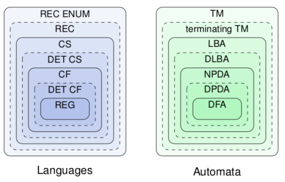

+++
title = "Lecture 9"
template = "page-math.html"
+++

*[TM]: Turing Machine
*[BFS]: breadth-first search

# Variations of Turing machines
## With multiple tapes
A TM with two tapes can be simulated by a TM with one tape: transition on two tapes translates to multiple transitions on one tape.
The difference in time complexity between TM with one tape and multiple tapes is a polynomial factor.

## Nondeterministic Turing machines
Nondeterministic TM has transition function $\delta : Q \times \Gamma \rightarrow 2^{Q \times \Gamma \times \lbrace L, R \rbrace}$

A nondeterministic TM can be simulated by a deterministic TM:
- the deterministic TM can use breadth-first search to simulate all executions of nondeterministic TM in parallel.
- the branches of the BFS can be stored on tape in form of queue

Difference in time complexity between deterministic and nondeterministic TM is exponential factor

## Universal Turing machines
A TM is "universal" if it can simulate every TM.

A universal TM gets as input: Turing machine M (described as word w), input word u.
It simulates M on u.
The inputs can be written on two different tapes, or behind each other on one tape.

The theorem is that there is a Turing machine. You just gotta believe it.

# Unrestricted grammars
These correspond to Turing machines.

Unrestricted grammar contains rules x → y, where x ≠ λ (and that's the only constraint).

Language L is generated by unrestricted grammar ↔ L is accepted by a Turing machine.

## Unrestricted grammars → Turing machines
For every unrestricted grammar there is Turing machine st the languages generated/accepted are identical.

How do you do it?
- input for machine M is word w, written on tape
- M can do BFS for derivation of w from S.
- if derivation found, then w accepted by M.
- then the two languages accepted/generated are equal.

## Turing machines → unrestricted grammars
For every Turing machine M there is an unrestricted grammar st the languages generated/accepted are identical.

How do you do it?
- Sorry, the stuff he put in the slides is too abstract for me here. When I actually have to learn it, I'll try to write it in a way that's easier to understand.

# Context-sensitive grammars
## Context-sensitive grammars
Grammar is context-sensitive if, for every rule x → y, |x| ≤ |y| and x ≠ λ.

For every context-sensitive grammar, there is a grammar that generates the same language, with rules of the form xAy → xvy (with v ≠ λ).

A language is context-sensitive if there is a context-sensitive grammar for it.

## Linear bounded automata
A nondeterministic TM (Q, Σ, Γ, δ, q₀, F).

There is no □; instead, symbols [ and ] are placed around the input word.

For every state q:
- δ(q,[) is of the form (q',[,R)
- δ(q,]) is of the form (q',],L)

The memory is restricted by the length of the input word.

A language accepted by a linear bounded automaton is a word reached from the start state, of the form `[uqv]`, where q is a final state and u,v ∈ Γ\*.

## Context-sensitive grammars to LBAs
For every context-sensitive grammar, there is an LBA that generates the same language.

A derivation of a word in the language contains only words of same or smaller length.
A nondeterministic Turing machine can simulate (guess) this derivation without leaving the bounds of w.

## LBAs to context-sensitive grammars
For every LBA, its language is context-sensitive.

Build unrestricted grammar of the same language; then, all production rules are context-sensitive except for □ → λ.
However, LBA does not use □, since it never leaves borders of input word.
So, drop rule □ → λ, and rules including □.

## Basic properties of context-sensitive languages
If $L_1$ and $L_2$ are context-sensitive, then so are $L_1 \cup L_2$, $L_1 \cap L_2$, $L_{1}{R}$, $L_{1}L_{2}$, $L_{1}{*}$, $\overline{L_1}$, $L_{1} \setminus L_2$

Proofs:
- $L_1 \cup L_2$, $L_{1}{R}$, $L_1 L_2$, $L_{1}{*}$: using grammars/automata
- $L_1 \cap L_2$: using LBAs
- $L_1 \setminus L_2 = L_1 \cap \overline{L_2}$
- $\overline{L_1}$: proven by people smarter than us (Immerman, Szelepcsenyi)

We don't know if deterministic LBAs are as expressive as nondeterministic LBAs.

# Recursively enumerable languages
Language is recursively enumerable if it's accepted by a Turing machine.

Turing machines are recursively enumerable:
- a TM can be represented as a word
- a parser can check whether a word represents a TM, and if so, accept
- so, there is recursive enumeration of all TMs

## Properties of recursively enumerable languages
The class of recursively enumerable Languages is closed under ∪ and ∩.
There exist recursively enumerable languages for which their complement is not recursively enumerable.

# Recursive languages
A language is recursive if it, and its complement, is recursively enumerable.
Not every recursively enumerable language is recursive.

Language is recursive ↔ it is accepted by a deterministic TM that halts for every input.

Context-sensitive languages are recursive, but not every recursive language is context-sensitive.

# The Chomsky hierarchy

# Countability
Turing machines are countable, languages aren't.

There are countably many Turing machines over an input alphabet Σ.
There are uncountably many languages over Σ.

Why:
- let a be a letter in Σ
- assume L₀, L₁,... is enumeration of all languages over {a}
- define language L as follows: for every i ≥ 0, $a{i} \in L \Leftrightarrow a{i} \notin L_i$
- then for every i ≥ 0, $L \neq L_i$
- then L is not part of the above enumeration; contradiction.
- so, not all languages are recursively enumerable
