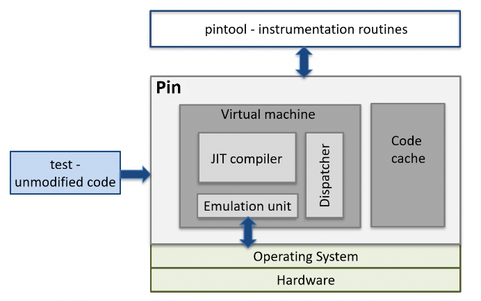

+++
title = 'Dynamic Binary Instrumentation & Intel Pin'
+++

# Dynamic Binary Instrumentation & Intel Pin
Full system emulation is powerful (full system visibility) but invasive (full system runs emulated).

Dynamic binary instrumentation (DBI) gives you binary-level visibility, and is efficient and self-contained.

Instrumentation: technique injecting code into binary to collect runtime info
- executes as part of normal instruction stream
- doesn't modify semantics of program

Instrumentation is good
- optimisation/profiling: instruction profiling, basic block count
- bug detection/exploit generation: find references to uninitialized addresses, inspect arguments at particular function call, inspect function pointers and return addresses, record & replay
- architectural research: processor and cache simulation, trace collection

Two classes
- static: instrument before runtime (source code, IR, binary)
- dynamic: at runtime (just in time, e.g. Pin, Valgrind, QEMU)
     - no need to recompile or relink, discover code at runtime, handles generated code, attaches to running processes
     - but: higher performance overhead, needs framework which malware can detect

Why binary instrumentation:
- libraries are a pain for source/IR instrumentation (e.g. proprietary)
- easily handles multilingual programs
- with malware you rarely get source code

## Intel Pin ([website](http://pintool.intel.com/))
DBI framework, can insert arbitrary code in arbitrary places in executable.

Can examine any type of instruction, track function calls including library and syscalls, track application threads, etc.

Instrumentation vs analysis:
- instrumentation routines: define where instrumentation inserted, invoked when instruction being JITted
- analysis routines: define what to do when instrumentation activated, invoked every time instruction is executed

Using it:
1. `export PIN_HOME=/path/to/pin/directory && make`
2. `pin -t /path/to/pin/code.so -- /path/to/binary`

Reducing Pin overhead:
- shift computation from analysis routines to instrumentation routines when possible
- instrument at largest granularity whenever possible (e.g. one call per basic block or trace)
- reduce number of arguments to analysis routines
- inline functions where possible (do `pin --log-inline` and look in pin.log)

Debugging Pin:
1. Run Pin with `-appdebug`
2. Start GDB and run `target remote :<number given by pin>`
3. Use GDB normally
