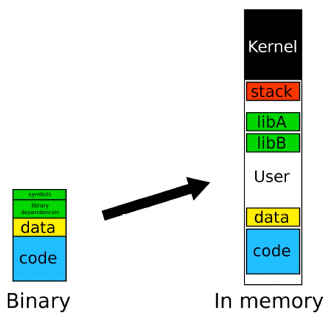

+++
title = 'Introduction'
+++

# Introduction
## Why binary analysis?
- Code improvement: performance/security (maybe the source code has been lost)
- Vulnerabilities: find exploits, pentest
- Malware: what does it do, how can we be safe, how can we stop it?

Static analysis: staring at the bytes and trying to see what they mean
- can be prevented by obfuscation, packing, encryption

Dynamic analysis:
- can be prevented by anti-debugger
- incomplete, maybe not all functionality actually runs

## Getting code from binary
Disassembler:
- interpret binary files and decode their instructions
    - assembly instructions map to sequence of bytes
    - but opposite way is not easy to do
- practical limitations
    - overlapping instructions
        - on e.g. x86, instructions have variable length
        - start address of instructions not know in advance
        - depending from which byte you disassemble, you might get different instructions
    - desynchronisation: how do you distinguish data from code?
- practical approaches
    - linear sweep (objdump, gdb, windbg):
        1. start at `.text` section
        2. disassemble one instruction after the other
        3. assume that well-behaving compiler tightly packs instructions
    - recursive traversal (IDA, OllyDbg)
        1. start at program entry point
        2. disassemble one instruction after the other until a control flow instruction
        3. recursively follow the instructions targets (e.g. addresses of `jmp`)
            - pros: better at interleaving data and codee
            - cons: coverage, what to do with indirect jumps?

Decompilation:
- issues:
    - structure lost, data types lost, no semantic information
    - no one-to-one-mapping between code and assembler blocks
- types of analysis:
    - static analysis: examine without running, could in principle tell us everything the program could do
        - levels of analysis
            - program level: tools like strings (strings used in program), readelf (examine structure of binary), ldd (shared libraries used), nm (symbols in a program), file, `cat /proc/<pid>/maps` (show memory mappings)
            - instruction level: disassemblers like IDA Pro
        - limitations: in principle undecidable, may be obfuscated/encrypted, doesn't scale to real world programs because of cost for huge programs, needs to model library/system calls and environment, hard to deal with indirect addressing and compiler optimizations
    - dynamic analysis: run and observe, tells us what the program does in a given environment with a particular input
        - containment is important (but maybe that changes its behaviour)

Analyzing a binary:

<table>
    <tr>
        <th></th>
        <th>Application level</th>
        <th>Instruction level</th>
    </tr>
    <tr>
        <td>Static analysis</td>
        <td>
        <ul>
        <li>Identify file type: <code>file foo</code></li>
        <li>Extract strings: <code>strings -a -t d foo</code></li>
        <li>Identify libraries and imported symbols
            <ul>
                <li><code>ldd</code> - list shared libraries</li>
                <li><code>nm</code> - list symbols, unless stripped</li>
            </ul>
        </li>
        </ul>
        </td>
        <td>
        <ul>
            <li>Tracking control flow</li>
            <li>Path slices</li>
            <li>Data flow graphs</li>
            <li>Value set analysis</li>
            <li>Symbolic execution</li>
        </ul>
        </td>
    </tr>
    <tr>
        <td>Dynamic analysis</td>
        <td>
        <ul>
        </ul
        <li>General info about the process: <code>/proc/<pid>/maps</code></li>
        <li>Library/system call trace
        <ul>
        <li><code>strace</code> - reveal system calls</li>
        <li><code>ltrace</code> - strace but for dynamically linked libraries</li>
        </ul></li>
        <li>Network sniffer like <code>netstat</code> or <code>tcpdump</code></li>
        </td>
        <td>
        <ul>
            <li>Improve accuracy of static analyses</li>
            <li>Dynamic information flow tracking, e.g. input and variable types</li>
            <li>Function call monitoring</li>
            <li>Combination of symbolic and dynamic execution</li>
        </ul>
        </td>
    </tr>
</table>

## What's a binary?
Common file formats:
- PE (Windows)
- ELF (Linux and others)

Defines things like what the file looks like on disk, what it should look like in memory

Contains info about machine to run it on, executable or library, entry point, sections, what should be writable and what should be executable

## What's malware?
Executable that
- hates debuggers and VMs
- hates being analyzed
- does bad things
- frequently controlled in a centralised or peer-to-peer fashion (botnet)
- often *packed*:
    - compressed to reduce size on disk
    - may have anti-debugging techniques
    - can't say that packed binaries are malware because normal software can also be packed
