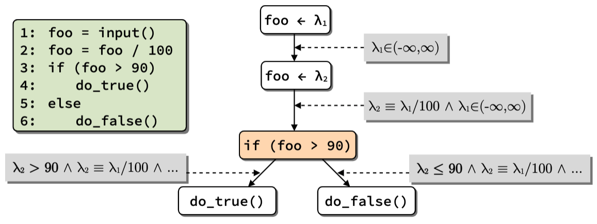

+++
title = 'Symbolic execution'
+++

# Symbolic execution
Execute programs with symbols instead of values
- program state (memory, registers, etc.) is symbolic and bound by constraints
    - have set of possible values
    - subject to constraints, i.e. mathematical restrictions on allowed values
    - symbolic variables/expressions are immutable
- perform all arithmetic & boolean operations symbolically
    - output symbolic expressions encoding operation performed
- fork state when branch depends on symbol
    - unconditional branch -- direct control flow
    - concrete conditional branch -- follow condition
    - symbolic conditional branch -- take both paths
        - fork program state and set IP to either path
        - add appropriate branch condition as path constraint
        - eventually explores all possible paths

        

- solve constraints to get values when needed ('concretization')

Problems with symbolic execution:
- state explosion: number of possible paths in a program is huge, increases with number of branches
- dealing with I/O: do nothing? output?
- modelling environment and hardware (and simulated hardware isn't the same)
- constraint solving: not all constraints are linear, NP-complete

Basic optimisations:
- expression simplification: use algebra to bring down to minimal form
- state merging: mitigate state explosion when little difference between states

Concolic (concrete + symbolic) execution:
- repeat:
    - dynamic analysis to capture trace for concrete run
    - symbolic execution on traced instructions, yielding path constraints
    - dynamic analysis to capture trace for concrete run
    - symbolic execution on traced instructions, yielding path constraints
    - adjust constraints by flipping last encountered symbolic branch
    - solve constraints of flipped branch, yielding inputs for new path
- advantages: no state explosion so much faster, symbolize only what you need
- drawbacks: need good initial input, can only flip branches controlled by symbolic variables, constraint solving is still hard

SMT solvers: Z3, CVC4, STP

SymbEx engines: KLEE, S2E, Angr, Triton

