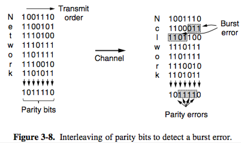
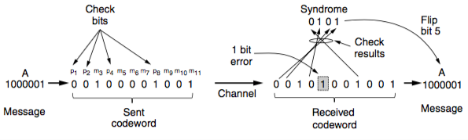
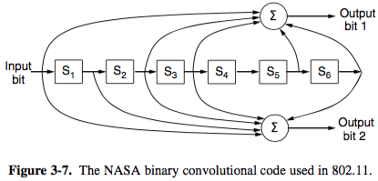

+++
title = "Data Link: Error detection/correction"
+++

# Data Link: Error detection/correction
**Errors**

- errors can be caused by hardware or software
- timer that expires if frame not acknowledged, then frame is resent
- flow control is feedback-based (receiver sends permission to sender for more data), or rate-based (built-in data send rate limiter)

Error detection

- adds enough redundancy so that receiver can detect error and request retransmission, used on highly reliable networks like fiber
- a codeword is n-bit unit with m data bits and r check bits
- parity bit
    - add a single bit to the end to make the number of 1s even
    - a code with a single parity bit can detect single-bit errors
    - however, not good with burst errors
    - to improve, interleave — compute parity in order different from transmission order:

- checksums
    - 16-bit Internet checksum — sum of message bits divided into 16-bit words
    - Fletcher’s checksum — adds product of data and its position to running sum
    - improved error detection over parity
    - detects bursts up to N errors
    - does not detect systematic fuckups
- Cyclic redundancy check
    - based on treating bit strings as polynomials with coefficients of only 0 and 1
    - polynomial eg. ×32 + x16 + x8+×1 + 1
    - sender and receiver agree on generator polynomial G(x) in advance, with both high- and low-order bits at 1
    - append a CRC to end of frame so that polynomial represented is divisible by G(x)
    - algorithm to send, with generator G(x):

        1. r is degree of G(x) — append r zero bits to end of frame so it now has m+r bits

        2. divide bit string G(x) into bit string from step 1 with long division (subtracting is mod 2, simply XOR)

        3. subtract remainder from bit string in step 1 using mod 2 subtraction, result is checksummed frame to transmit

    - when received, checks if frame is divisible by G(x). if not, the remainder is the error (E(x)/G(x))

Error correction

- adds enough redundancy to be able to correct errors, used on unreliable networks like 802.11
- Hamming distance
    - shortest distance to change one string into another
    - compute: XOR two bit strings and count number of ones in result
    - with Hamming distance d, you can detect d-1 errors
- Hamming codes ([video](https://youtu.be/373FUw-2U2k))
    - if Hamming distance n, we can correct (h-1)/2 errors
    - bits of codeword are numbered, with 1 at very left
    - at powers of 2 are check bits, others are data
    - sender:

        1. expand locations into powers of 2

        2. decide Value of check bit in location 2i by mod 2 adding all bits with 2i in expansion

    - receiver:

        1. Redo all bit computations

        2. For even parity, each check result should be zero. If not, an error has been detected.

            - check bits for whole message are error syndrome
            - convert to decimal n, then nth bit is error

- Convolutional code
    - encoder processes input bits & generates output bits
    - output depend's on current and previous input bits (constraint length)
    - encoder has memory, e.g. in six registers
    - e.g. NASA r=1/2 and k=7 (also in 802.11) — each input bit on left side produces two output bits that are XOR sums of input and internal state:

