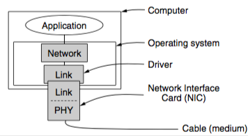
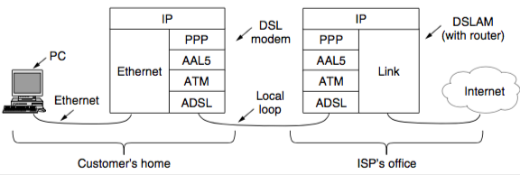

+++
title = "Data Link: Protocols"
+++

# Data Link: Protocols
**Protocols**

- link layer commonly implemented as NIC (physical layer, some data link layer processes) and OS drivers (rest of link layer processes)
- make sure that receiver is ready for next frame with acknowledgements, timers, etc.
- Utopian simplex
    - does not worry about anything going wrong
    - simplex — data sent only in one direction
    - sender is infinite while that gets data from network and puts data on physical
    - receiver waits until arrival of frame, then puts on network
- Simplex Stop-and-Wait
    - also only one direction
    - sender passes a packet, then waits for receiver to send back a ‘dummy’ frame to acknowledge
    - Automatic Repeat ReQuest (ARQ)
        - receiver acknowledges correctly delivered frames
        - sender resends on timer if no acknowledge
        - frames must be numbered (1 bit is enough)
- Sliding Window
    - piggyback with two senders — add acknowledgement to outgoing frame
    - sending window — at any instant of time, sender maintains set of sequence numbers for frames that i can send
    - receiving window — receiver has a set of frames that it can accept
- Go-back-n
    - if error while pipelining, discard all subsequent frames without sending acknowledgements
    - receive window of size 1
    - can waste a lot of bandwidth
- Selective repeat
    - a bad frame that is received is discarded, any good frames after are accepted and buffered
    - only oldest unacknowledged frame is resent

**Example: ADSL (Asymmetric Digital Subscriber Loop)**

- most popular scenario:

    1. Inside home, PC sends IP packets to DSL modem over Ethernet
    2. DSL modem sends IP packets to DSLAM (DSL Access Muxer)
    3. DSLAM extracts IP packets and sends them to ISP network

