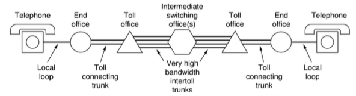
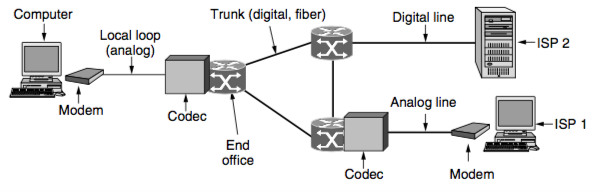
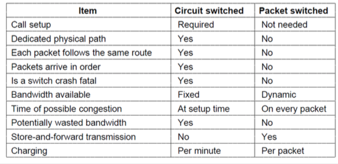
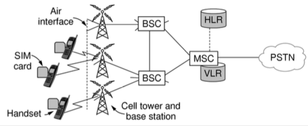
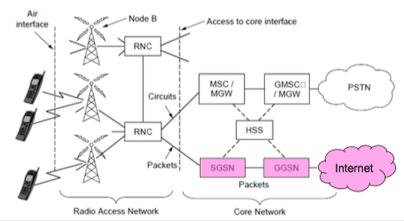
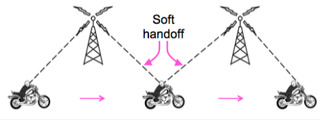
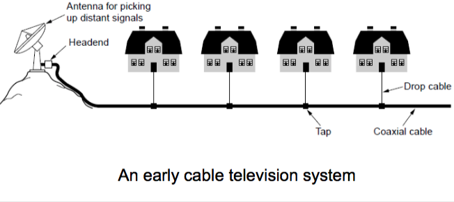
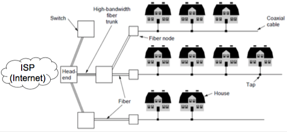

+++
title = "Examples of networks"
+++

# Examples of networks
**Public switched telephone network (PSTN)**

- the old system used an operator who would connect wires using a jumper cable
- components:
    - local loops — analog twisted pairs to houses/businesses
    - trunks — digital fiber optic links between switching offices
    - switching offices — move calls from one trunk to another

the local loop:

- two wires from telephone company end office into houses
- to send bits, must convert to analog signals to transmit, and then back again
- enter the ‘modem’ (modulator demodulator)
    - inserted between digital computer and analog telephone system
    - built into computer (e.g. telephone modems) or in a separate box (DSL and cable modems)
    - low rates at <56 kbps, early way to connect to internet

- DSL (Digital Subscriber Lines) — telephone/computers attached to same old phone line, rates vary with line
- Fiber to the Home (FttX) — relies on deployment of fiber optic cables, one wavelength shared among many houses, no need for amplifiers

trunks & multiplexing (PCM: pulse code modulation)

- calls are carried using TDM (time division multiplexing), but that only works with digital data
- codec (coder decoder) converts analog signal to digital by sampling at 8 kHz (since telephone channel has 4 kHz bandwidth)
- each sample is quantised to an 8-bit number

switching

- circuit switching — establish a physical path, *before *any data is sent (the old way of doing stuff)
    - wasted bandwidth if reserved bandwidth is not used for traffic
    - guaranteed service, but wasted resources
- packet switching — packets are sent as soon as they’re available, don’t need a path in advance
    - routers have to use store-and-forward transmission to send each packet
    - no fixed path, different packets can follow different paths and could come out of order
    - no bandwidth is reserved, packets might wait to be forwarded, introducing queuing delay
        - queuing delay for M/M/1 system: Q = 1/(1-ρ) * T
        - ρ is line utilisation

    - however, no bandwidth is wasted because of no traffic on reserved channel like in circuit switching
    - guaranteed service and no resources wasted

**Mobile Telephone System**
Generations:

- 1G: analog voice. modulation based on FM radio. ex: AMPS
- 2G: analog voice and digital data. modulation based on QPSK. ex: GSM
- 3G: digital voice and data. modulation based on CDMA. ex: UMTS
- LTE: digital data including voice. modulation based on OFDM. ex: LTE
- 4G: based on CDMA and 802.16m.

Why “cell/cellular”?

- Based on idea of spatial regions called cells
- Moving across cells causes handoffs
- Frequencies are reused across non-adjacent cells
- Smaller cells can be used to support more mobile phones

2G GSM:

- mobile has handset and SIM (Subscriber Identity Module) card with creds
- mobiles tell HLR (home location register) whereabouts for incoming calls
- cells keep track of visiting mobiles
- air interface has FDM channels of 200 KHz, with eight-slot TDM frame every ~4.6 ms

3G GSM:

- high quality voice, messaging, multimedia, internet access
- not compatible with 2G GSM
- air interface is based on CDMA over 5 MHz channels

4G:

- pure IPv6 packet switching, no circuit switching
- no voice except as VoIP
- 1 Gbps for stationary, 100 Mbps for moving user
- uses carrier aggregation (multiple bands) and OFDMA (orthogonal freq div mux access)
    - OFDMA: each channel is broadcast in parallel on different freq bands

**Cable Television**

- internet over cable uses cable television plant
- data is sent on shared cable tree, not on DSL
- cable modems at customer implement physical layer of DOCSIS

