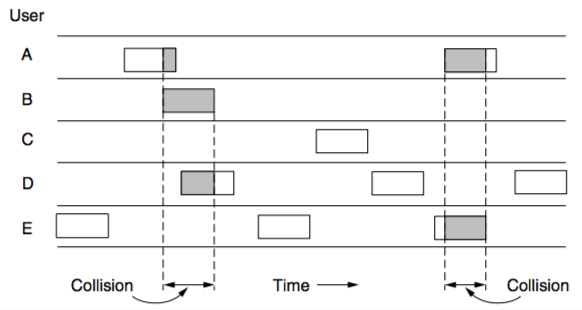
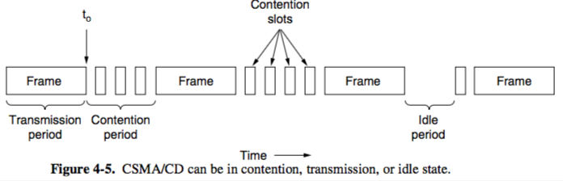
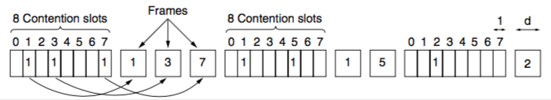
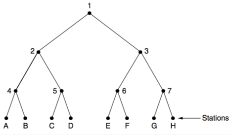

+++
title = "MAC: Protocols"
+++

# MAC: Protocols
Multiple access protocols

- ALOHA
    - Hawaii, early 1970s
    - used short-trange radios, each user terminal sharing the same upstream frequency to send frames to central computer
    - pure:
        - let users transmit data
        - the centre computer rebroadcasts frame to all stations, and sender can listen to see if its frame came through
        - if frame was destroyed (incorrect checksums on both frames), sender waits a random amount of time and then resends

    - slotted:
        - time is in discrete intervals called slots
        - station is not allowed to send when a user types a line
- Carrier Sense Multiple Access Protocols (contention)
    - 1-persistent CSMA (transmits with a probability of 1 with idle channel)
        - when station wants to send data, it listens to the channel first
        - if channel is idle, it sends the data
        - otherwise, it waits until the channel becomes idle and then sends
        - on collision, station waits a random amount of time and starts again
    - nonpersistent CSMA
        - station senses the channel and sends if the channel is idle
        - if in use, does not continually sense but waits a random period of time before repeating the algorithm
        - better channel utilisation but longer delays
    - p-persistent CSMA (applies to slotted channels)
        - station senses the channel
        - if idle, transmits with a probability *p*
        - with a probability q = 1-p, defers until next slot
        - if next slot also idle, either transmits or defers again with probabilities *p* and *q*
    - CSMA/CD (CSMA with Collision Detection)
        - station’s hardware listens to channel while it is transmitting
        - if signal in differs from signal out, a collision is occurring
        - at t0, a station has finished transmitting frame and any other can start transmitting (collisions may and will occur):

- Collision-free
    - Bit-map protocol
        - an example of a reservation protocol
        - each contention period consists of N slots
        - if station *j* announces that it has a frame to send by transmitting a 1 bit in slot *j*
        - after all N slots pass by, each station can transmit without colliding without others because it has knowledge of when they transmit

    - Token passing (sesh circle)
        - stations pass small message (“token”) representing permission to send
        - either pass, or send frame then pass
        - token ring — stations are connected one to the next in circle, the token is passed around like a joint
        - token bus — stations are not in a circle, but connected via a token bus which is used to pass the token in a predefined sequence
    - Binary countdown
        - a station that wants to use the channel broadcasts its address a binary bit string, starting with high-order bit (all addresses same length)
        - bits in each address position from different stations are ORed together by channel
        - as soon as a station sees that its 0 bit has been overwritten to a 1, it gives up and lets the other stations transmit
- Limited-contention
    - Adaptive tree walk
        - stations are leaves of a binary tree
        - in first contention slot after a frame transmission (slot 0), all stations try to acquire the channel
        - if successful, alright ¯\_(ツ)_/¯
        - if collision, during slot 1 only stations in node 2 can compete
            - if acquired, next slot after frame is reserved for stations under node 3
            - otherwise, node 4 competes in slot 2

- Wireless LAN protocols
    - hidden terminal problem — station may not detect a potential competitor because it’s too far away
    - MACA (Multiple Access with Collision Avoidance)
        - sender sends a RTS (request to send) along with length of upcoming data frame
        - receiver replies with CTS (clear to send) with copied data length
        - when sender receives CTS, it begins data transmission
        - if a station overhears a RTS and CTS, it remains silent during time in CTS frame
