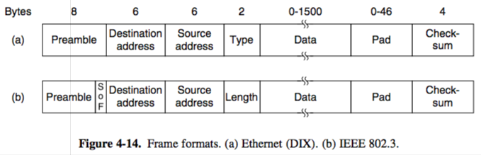

+++
title = "MAC: Use in Ethernet"
+++

# MAC: Use in Ethernet
**802.3 — Ethernet**
Classic Ethernet

- all computers attached to single long cable (thicc Ethernet cable like garden hose, then thin Ethernet using BNC connectors)
- multiple cables connected through repeaters that amplify and retransmit signals
- frame formats
    - preamble: 7 bytes of 10101010, 1 byte of 10101011
    - dest & src address: unique, address of all 1 bits is broadcast. to multicast to group of stations, first bit of dest should be 1. otherwise, 0.
    - type/length: type is which process to give frame to, length is self-explanatory
    - checksum: 32-bit CRC

Switched Ethernet

- a switch has a high-speed backplane connecting all of the ports
- you can add or remove stations by plugging or unplugging wires
- switches output frames to their respective ports
- each port is its own collision domain, and if cable is full duplex, collisions are impossible (if not, just use CSMA/CD)
- bridges connect multiple LANs together
- use backward learning to route frames:

    1. If port for dest address is same as source port, discard frame

    2. If port for dest address and source are different, forward frame onto dest port

    3. If dest port is unknown, use flooding and send frame on all ports except source port

- redundant links can be used between bridges for higher reliability, but introduces loops
- better is a spanning tree, where a root node is selected using the ID, then shortest paths from root are traced across the bridges
