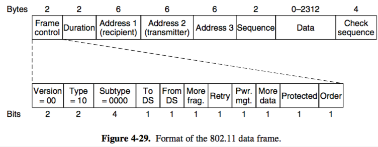
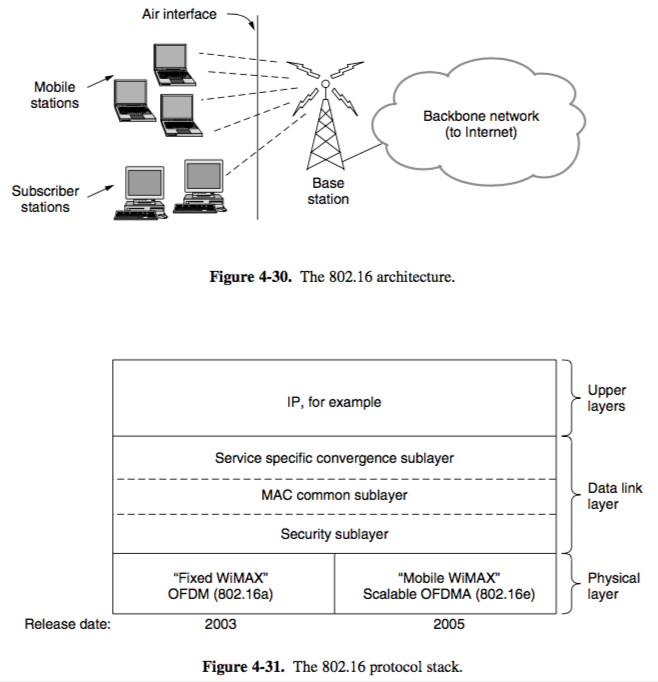
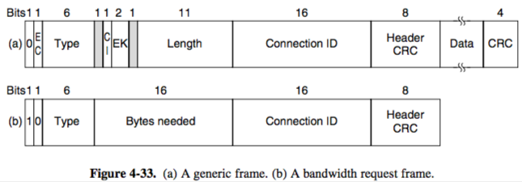

+++
title = "MAC: Use in Wifi & Broadband"
+++

# MAC: Use in Wifi & Broadband
**802.11 — WiFi**

- stations cannot detect collisions, relies on acknowledging to determine if collision occurred
- uses CSMA/CA (collision avoidance, not detection)
    - inserts backoff slots to avoid collisions
    - physical channel sensing:
        - sense if channel is being used
        - if yes, wait for it to be idle and then send
    - virtual channel sensing:
        - frames have a Network Allocation Vector indicating length of exchange
        - simply wait until end of transmission

- frame format:

- power saving:
    - beacon frames: client wakes up for every beacon and checks traffic map to see if there is buffered traffic that it can request
    - automatic power save delivery (APSD): access point buffers frames and sends them to client right after client sends frames, then client goes to sleep
- authentication — WEP (Wired Equivalent Privacy), then WPA (Wifi Protected Access) and WPA2

**802.16 — Broadband Wireless**

