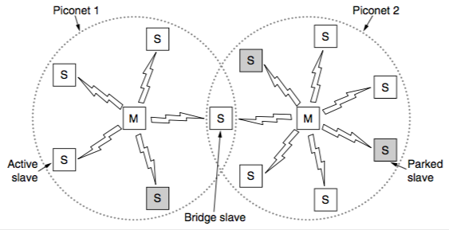
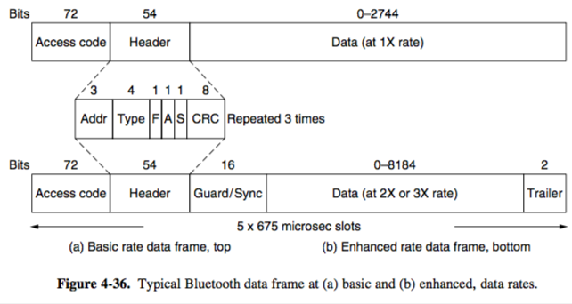
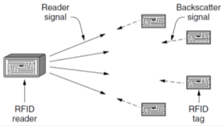
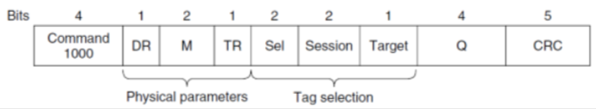

+++
title = "MAC: use in Bluetooth & RFID"
+++

# MAC: use in Bluetooth & RFID
**Bluetooth**

- piconet master connected to slave wireless devices
- slaves may be asleep to save power
- two piconets can be bridged through slave to make a scatternet

- profiles give set of protocols for a given application (and there’s 25 of them WTF)
- radio layer uses adaptive freq hopping in 2.4 GHz band
- link layer uses TDM, links auth via pairing
- frame format:

**RFID**

- reader signal powers tags, tags reply using backscatter:

- gen 2 tag identification:

    1. Reader sends query and sets slot structure
    2. Tags reply in a random slot with possible collisions
    3. Reader asks one tag for identifier — acknowledge
    4. Process continues until no tags left

- reader frames vary depending on type, reader sets timing and knows expected format
- tag responses are data only
- frame structure:

