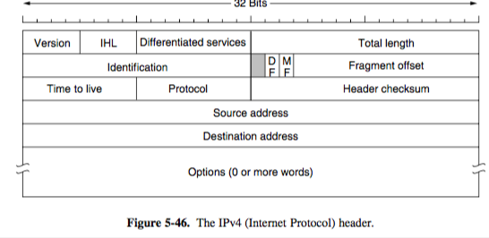
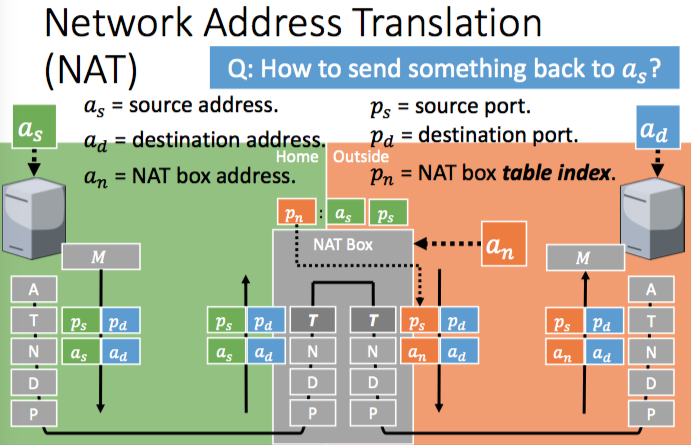

+++
title = "Network: internet protocols"
+++

# Network: internet protocols
**Internet protocols**
IPv4

- uses 32-bit addresses, in dotted decimal notation (e.g. 0x80D00297 == 128.208.2.151)
- prefixes are written with lowest IP address in block and size of block
- a prefix 37.60.0.0/16 means that first 16 bits are used by network
- subnet mask — a string of 1s that has length of number after slash in the network portion of IP address (so 16 in /16), IP address AND subnet mask gives network prefix
- header:

- Classless InterDomain Routing (CIDR) — combining multiple small prefixes into a larger prefix (route aggregation), with each router having the corresponding prefix information (like /22 or /20)
- Network Address Translation (NAT)
    - house/company has a single external IP address and ports
    - devices have internal IP addresses
    - a Network Address Translation Box decides how to route within the home network

IPv6

- many more addresses, simplified header (better bandwidth/latency), easier to add options, improved security support
- uses 128-bit addresses, in hex notation (e.g. 8000::123:3567:89AB:CDEF)

Internet Control Protocols

- Internet Control Message Protocol (ICMP)
    - if there’s a fuckarino, routers send these messages to senders
    - used e.g. when dest is unreachable, time exceeded (used by traceroute), echo/echo reply (used by ping), router advert/solicitation
- Address Resolution Protocol (ARP)
    - A outputs broadcast packet asking who owns an IP address, to every machine on the network
    - only the host with the IP address responds with Ethernet its address
- Dynamic Host Configuration Protocol (DHCP)
    - every network has a DHCP server
    - on startup, a computer has a built-in link layer address in NIC, but no IP address
    - computer sends DHCP DISCOVER packet to server, which allocates a free IP address and sends back a DHCP OFFER packet
    - leasing — IP address assignment is for a fixed period of time, host has to ask for renewal just before it expires or lose the address
- MultiProtocol Label Switching (MPLS)
    - adds a label in front of each packet, forwarding is based on the label instead of dest address
    - in between IP network protocol and PPP link protocol (it’s a “layer 2.5 protocol”)
    - MPLS headers are not part of layer packet or data link frame, so it’s independent — it can forward both IP and non-IP packets (hence “multiprotocol”)

Interior Gateway Protocols

- example — Open Shortest Path First (OSPF)
- routing within a large independent network
- a form of link state routing, uses a hierarchy called ‘areas’

Exterior Gateway Protocol

- example — Border Gateway Protocol (BGP)
- routing between large independent networks
- supports arbitrary policies from ISPs/companies/countries
- a form of distance vector routing combined with a path vector protocol
