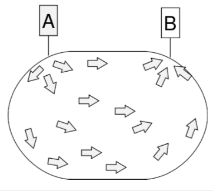
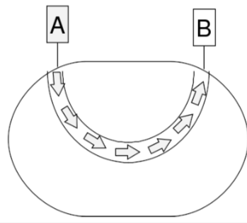

+++
title = "Network: overview"
+++

# Network: overview
The layer answers:

- how to get from A to B
- how to prevent network congestion
- how to provide quality of service
- how to connect multiple networks together

layers below it don't know about end-to-end delivery
layers above it don’t know about the network topology
nobody knows anything about routing — it’s the network layer’s job

**Service types — connectionless v.s. connection-oriented**

|     |     |
| --- | --- |
| Connectionless | Connection-oriented |
| - routers use algorithms for routing to send each packet individually - used by IP  | - fixed route decided when a connection is made - all packets go along that route - sometimes used by ISPs on top of IP  |
