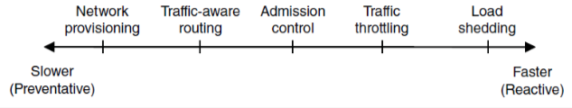
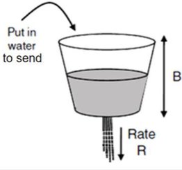
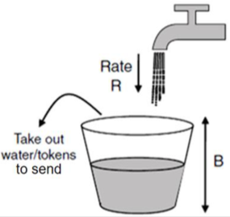
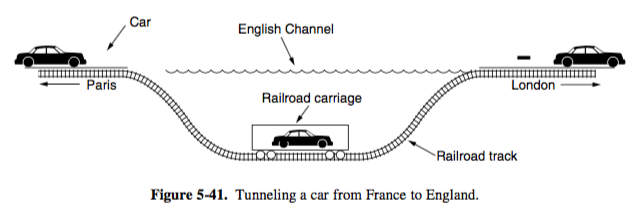
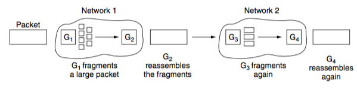
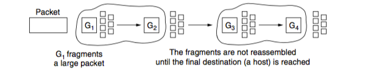
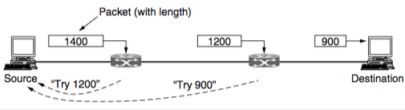

+++
title = "Network: providing service"
+++

# Network: providing service
**Congestion control**
Various approaches:

- network provisioning — preventing by increasing available bandwidth (like widening a road)
- traffic-aware routing — choose routes based on traffic, not just topology
- admission control — if there’s congestion, new traffic has to wait (like planes at an airport)
- traffic throttling — send messages back to indicate network congestion (e.g. special bits in IP packet, inform through TCP)

    - end-to-end — destination sends choke signal, source receives it and slows down transmission
    - link-by-link — destination sends choke signal, every router along the way slows down transmission

- load shedding — choose partial failure over total failure (that’s a good life motto)

    - easy to implement, but packet loss will likely happen due to congestion
    - Random Early Detection (RED) — drop packets randomly if buffer space is almost full, send implicit signal to sender to hold their horses

On a scale of slower preventative to faster reactive:

**Quality of service**
parameters of QoS:

- Bandwidth — max data rate, in bits per second (bps)
- Delay — time it takes from source to destination (sec)
- Jitter — variation in packet delay (constant delay is 0)
- Packet loss — probability of packets being dropped

To guarantee QoS (or at least try), you need to control the traffic through:

- controlling data rate
- packet scheduling
- admission control

Traffic shaping regulates rate and burstiness of data entering the network:

- Leaky bucket — sending rate is ≤R, max queue size is B:

- Token bucket — limit average rate to R, limit short-term bursts up to B

**Internetworking**
sending packets over multiple networks that use their own protocols

Tunnelling

- if source and destination use same protocols

- e.g. if host in Paris wants to send an IPv6 packet to an IPv6 host in London over the IPv4 internet, the IPv6 packet can be encapsulated inside of an IPv4 packet.

- or, if a car that can drive on a road is transport as freight from one road to another using a train

Packet fragmentation
each network puts a maximum size on packets
size can be limited by hardware/software/protocols/law/…
e.g. max payload for

- 802.3 - 1500 B

- 802.11 - 2272 B

- IP - 65,515 B

    - Transparent — packets are reassembled at every router

- Nontransparent — packets are reassembled only at final destination (host), this is what IP uses

- path MTU (max transmission unit) discovery
    - each IP packet is sent with header bits disallowing fragmentation
    - if a router receives a packet that’s too large, it drops it and sends back an error packet with required size.
    - source then uses info inside error packet to refragment the original packet into smaller pieces

