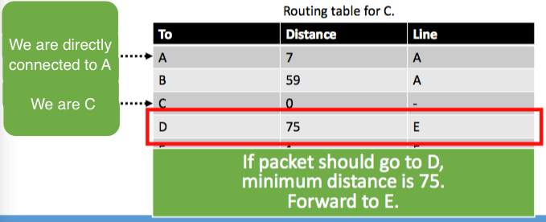
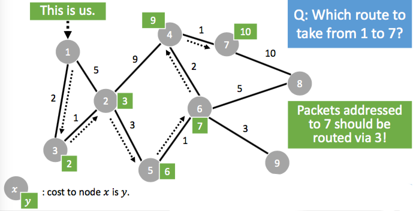
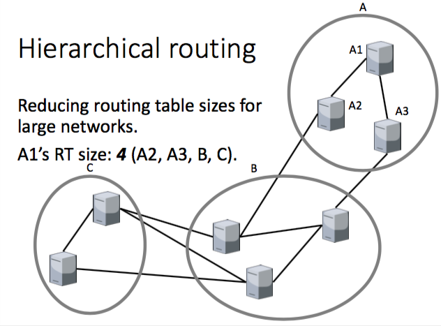

+++
title = "Network: routing"
+++

# Network: routing
**Routing — from point A to point B**
Important properties (there is often a trade-off):
1. Correctness
2. Simplicity
3. Robustness
4. Stability
5. Fairness
6. Efficiency

Methods of routing

- Distance vector routing
    - send distance vector to neighbours (distance to all nodes)
    - use incoming distance vectors to build a routing table:

    - however, when a machine fails, it leads to a count to infinity problem
- Link state routing
    - routers only send packets with info about direct neighbours
    - these packets are flooded (sent to everyone)
    - routers build overview of network using those packets, with a shortest path algorithm (Dijkstra)

- no count to infinity problem, but more complicated
- Hierarchical routing
    - route to groups of nodes instead of individual nodes
    - good for large networks

