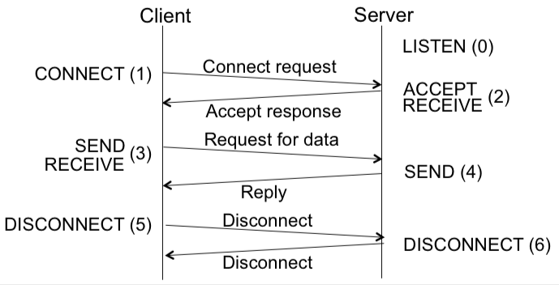

+++
title = "Overview"
+++

# Overview
Network types:

- Personal Area Network: range of a person
- Local AN: home/office building
- Metropolitan AN: over e.g. city (like cable tv)
- Wide AN: over a country (an ISP is a WAN, so is a VPN)

Protocol layers

- each protocol instance talks to its peer, using only the layer below
- lower level services are accessed through interface.
- at bottom, medium carries messages
- each lower layer adds a header with ctrl info
- example protocol stack:

- base stations remove headers that are not relevant:

- connection-oriented layer service has to be set up for ongoing use, in connectionless service messages are handled separately (like postal service)

Services & protocols

- service is provided to higher layer as primitives
    - LISTEN, CONNECT, SEND, RECEIVE…
    - example of communication:

- a layer provides service to one above (vertical)
- a layer talks to its peer using a protocol (horizontal)

OSI reference model (international standard)
